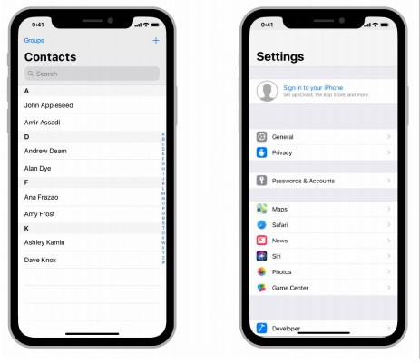
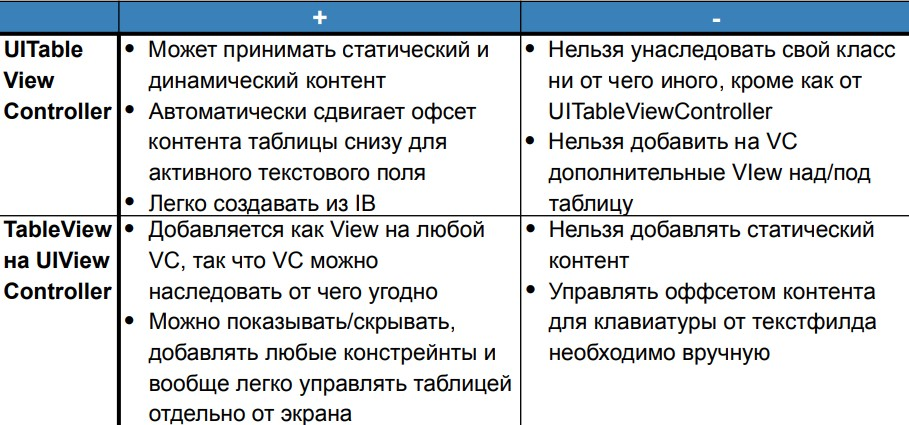
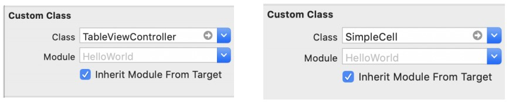
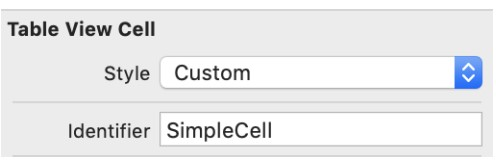
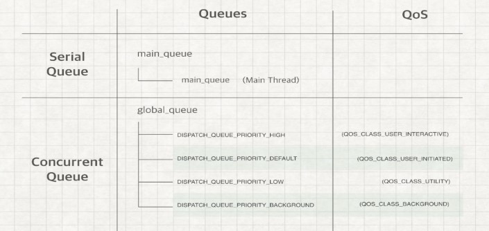
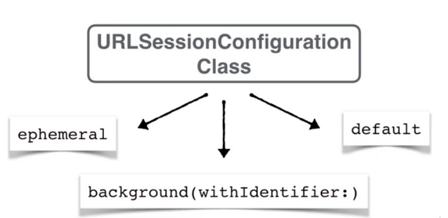
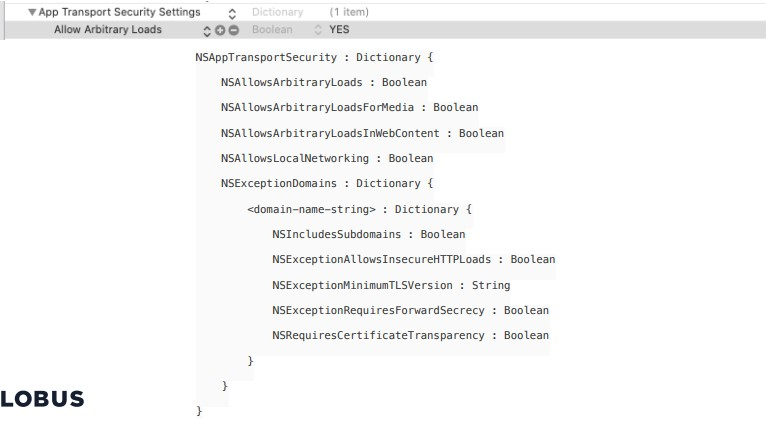
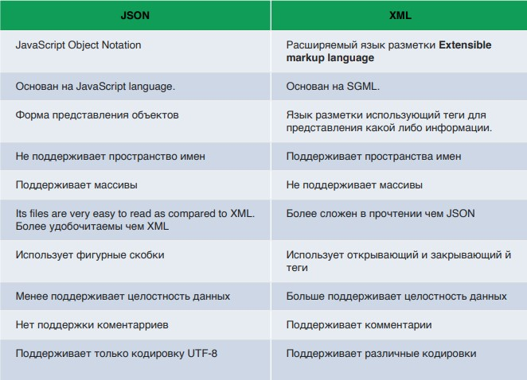

# Темы для контрольной
## Оглавление
- [Темы для контрольной](#темы-для-контрольной)
  - [Оглавление](#оглавление)
  - [Основы Swift](#основы-swift)
    - [Типы данных](#типы-данных)
    - [Операторы](#операторы)
    - [Циклы](#циклы)
    - [Функции](#функции)
    - [Замыкания (closures)](#замыкания-closures)
    - [Протоколы](#протоколы)
    - [Наследование](#наследование)
    - [Расширения протоколов](#расширения-протоколов)
- [**_спросить Андрея_**](#спросить-андрея)
    - [Структуры и классы](#структуры-и-классы)
- [UI & VC](#ui--vc)
  - [Жизненный цикл View Controller:](#жизненный-цикл-view-controller)
  - [Передача данных между контроллерами](#передача-данных-между-контроллерами)
    - [Делегаты](#делегаты)
- [Коллекции](#коллекции)
  - [Table View](#table-view)
  - [Collection View (layout methods)](#collection-view-layout-methods)
- [Многопоточность](#многопоточность)
  - [GCD](#gcd)
  - [Operation](#operation)
- [Работа с сетью](#работа-с-сетью)
  - [URLSession](#urlsession)
  - [Error handling](#error-handling)
  - [Codable](#codable)
  - [JSON parsing](#json-parsing)
- [Хранение данных](#хранение-данных)
  - [CoreData](#coredata)
  - [UserDefaults](#userdefaults)
- [Паттерны и шаблоны проектирования](#паттерны-и-шаблоны-проектирования)
  - [MVC](#mvc)
  - [MVVM](#mvvm)
  - [VIPER](#viper)
  - [Builder pattern](#builder-pattern)
  - [Dependency Injection](#dependency-injection)

1. [Коллекции](#Коллекции)
2. [Многопоточность](#Многопоточность)
3. [Работа с сетью](#Работа-с-сетью)
4. [Хранение данных](#Хранение-данных)
5. [Паттерны и шаблоны проектирования](#Паттерны-и-шаблоны-проектирования)

## Основы Swift
**Swift** — современный высокоуровневый строго типизированный объектно-ориентированный язык
для iOS и OS X. Он совместим с Objective-C, но привносит много идей и заимствований из других
современных языков: дженерики, функциональный стиль программирования, выведение типов.
Программы на нём рассчитаны на платформы OS X и iOS.
Swift позволяет избежать распространенных ошибок программирования, используя современные
шаблоны программирования:
* Переменные всегда инициализируются перед использованием.
* Индексы массива проверяются на наличие недопустимых ошибок.
* Целые числа проверяются на переполнение.
* Опционалы гарантируют, что значения nil обрабатываются явно.
* Память управляется автоматически.
* Обработка ошибок позволяет контролировать восстановление после непредвиденных сбоев.     

Код Swift компилируется и оптимизируется, чтобы максимально эффективно использовать
современное оборудование.             

[вернуться к оглавлению](#Оглавление)
### Типы данных   

**Объявление констант и переменных**

```swift
let maximumNumberOfLoginAttempts = 10
var currentLoginAttempt = 0
var x = 0.0, y = 0.0, z = 0.0
```

**Аннотация типов**


```swift
var welcomeMessage: String
```
Swift - язык со строгой типизацией.     
Swift всегда выбирает Double (вместо Float), когда выводит тип чисел с плавающей точкой:
``` swift
let pi = 3.14159
// pi выводится как тип Double
let anotherPi = 3 + 0.14159
// anotherPi тоже выводится как тип Double даже если есть целый литерал
```

**Простые типы**

* Целые числа: Int, UInt, Int8, Int16,… UInt64
* Числа с плавающей точкой: Double, Float
* Логический тип: Bool имеет значения true, false
``` swift
let i = 1
if i {
 // this example will not compile, and will report an error
}
```

**Строки и символы**

Строка - это серия символов, таких как `"hello, world"`. Строки Swift представлены типом String. Доступ к содержимому строки можно получить различными способами, в том числе в виде набора значений символов.  
Типы Swift String и Character обеспечивают быстрый Unicode-совместимый способ работы с текстом в вашем коде.    
Строковые литералы:
```swift
let singleLineString = "These are the same."
let multilineString = """
These are the same.
"""
```  

**Массивы**

Массив хранит значения того же типа в упорядоченном списке. Одно и то же значение может появляться в массиве несколько раз в разных позициях.   
Пример работы с массивами:
```swift
//Collections
var someInts = [Int] ()
var shoppingList: [String] = ["яйца", "молоко"]
shoppingList[0] = "перепелиные яйца"
shoppingList.insert("хлеб", at: 1)
shoppingList.append("пармезан")
print("for (index, item) in shoppingList.enumerated()")
for (index, value) in shoppingList.enumerated() { //для получения индексов используется enumerated()
 print("\(index + 1)" + ") " + value)
}
print("\nfor item in shoppingList")
for item in shoppingList {
 print(item)
}
```

**Множества**

Множество хранит различные значения одного и того же типа в коллекции без определенного порядка. Объекты должны быть хэшируемы, то есть подчиняться протоколу `Hashable`.   
Пример:
```swift
var set1 = Set<Character>()
set1.insert("A")
set1.insert("B")
set1.insert("C")
var set2: Set<Character> = ["C", "D", "E"]
print("union: \(set1.union(set2))")
print("subtracting: \(set1.subtracting(set2))")
print("intersection: \(set1.intersection(set2))")
print(“symmetricDifference: \(set1.symmetricDifference(set2))")
//union: ["B", "C", "D", "A", "E"]
//subtracting: ["B", "A"]
//intersection: ["C"]
//symmetricDifference: ["D", "E", “A", "B"]
```

**Словари**

В словаре хранятся ассоциации между ключами одного типа и значениями одного типа в коллекции без определенного порядка. Ключи должны быть Hashable.
```swift
var dict = Dictionary<String, String>()
dict.updateValue("торт", forKey: "десерт")
dict["основное блюдо"] = "медальон из говядины"
dict.merge(["напиток" : "квас"]) { (current, _) -> String in
 current
}
print(dict) //["десерт": "торт", "основное блюдо": "медальон из говядины", "напиток": “квас"]
dict["основное блюдо"] = "лазанья"
print(dict) //["десерт": "торт", "напиток": "квас", "основное блюдо": "лазанья"]
dict.removeValue(forKey: "десерт")
print(dict) //["основное блюдо": "лазанья", "напиток": "квас"]
for (key, value) in dict {
 print("\(key) - \(value)")
}
//основное блюдо - лазанья
//напиток - квас
for key in dict.keys {
 print(key)
}
//основное блюдо
//напиток
for key in dict.values {
 print(key)
}
//квас
//лазанья
```

[вернуться к оглавлению](#Оглавление)
### Операторы

[все операторы](https://developer.apple.com/documentation/swift/operator_declarations)     

**Оператор присваивания: = (не возвращает значения)**

```swift
var a = 1
var b = 2
if a = b { // Will produse "Use of '=' in a boolean context, did tou mean '=='?"
}
```

**Арифметические операторы: +, -, \*, /**  

В отличие от арифметических операторов в C и Objective-C, арифметические операторы Swift не допускают переполнения значений по умолчанию. Вы можете выбрать поведение переполнения, используя операторы переполнения Swift (например, a & + b):
```swift
var unsignedOverflow = UInt8.max
// unsignedOverflow equals 255, which is the maximum value a UInt8 can hold
unsignedOverflow = unsignedOverflow &+ 1
// unsignedOverflow is now equal to 0
```
Оператор сложения также поддерживается для конкатенации строк:
```swift
"hello, " + "world" // equals "hello, world”
```

**Оператор получения остатка: %**

```swift
-11 % 5 = -1
```

**Унарный минус: -**

```swift
let three = 3
let minusThree = -three
let plusThree = -minusThree // plusThree equals 3, or "minus minus three"
```
Унарный оператор минус (-) добавляется непосредственно перед значением, с которым он работает, без пробелов.        

**Унарный плюс: +**    

Унарный оператор плюс (+) просто возвращает значение, с которым он работает, без каких-либо изменений:
```swift
let minusSix = -6
let alsoMinusSix = +minusSix // alsoMinusSix equals -6
```

**Составные операторы присваивания: +=, -+, \*=, /=, … (не возвращают значение)**

```swift
var a = 1
a += 2 // a is now equal to 3
```

**Операторы сравнения: ==, <, >, <=, >=, !=, ===, ==**
```swift
(1, "zebra") < (2, "apple") // true because 1 is less than 2; "zebra" and "apple" are not compared
(3, "apple") < (3, "bird") // true because 3 is equal to 3, and "apple" is less than "bird"
(4, "dog") == (4, "dog") // true because 4 is equal to 4, and "dog" is equal to "dog"
("blue", -1) < ("purple", 1) // OK, evaluates to true
("blue", false) < ("purple", true) // Error because < can't compare Boolean values
```

**Операторы диапазона: m…n и m..<n**

```swift
for index in 1...5 {
 print("\(index) times 5 is \(index * 5)")
}
// 1 times 5 is 5
// 2 times 5 is 10
// 3 times 5 is 15
// 4 times 5 is 20
// 5 times 5 is 25
```

**Односторонние диапазоны: n…, …n, ..<n**

```swift
let names = ["Anna", "Alex", "Brian", “Jack”]
for name in names[..<2] {
 print(name)
}
// Anna
// Alex
let range = ...5
range.contains(7) // false
range.contains(4) // true
range.contains(-1) // true
```

**Логические Операторы: !, &&, ||**

Логические операторы изменяют или объединяют значения логической логики true и false. Swift поддерживает три стандартных логических оператора в языках на основе C:      
> **Важно**     
> Логические операторы Swift && и || являются левоассоциативными, что означает, что составные выражения с несколькими логическими операторами сначала оценивают крайнее левое подвыражение.   

**Тернарные операторы: a ? b : c** - имеет возвращаемое значение  

**Сравнение множеств**

* Оператор «равно» (==), чтобы определить, содержат ли два множества все одинаковые значения.
* Метод `isSubset (of :)`, чтобы определить, содержатся ли все значения множества в указанном множестве.
* Метод `isSuperset (of :)`, чтобы определить, содержит ли множество все значения в указанном множестве.
* Методы `isStrictSubset (of :)` или `isStrictSuperset (of :)`, чтобы определить, является ли множества подмножеством или надмножеством, но не равным указанному множеству.
* Метод `isDisjoint (with :)`, чтобы определить, не имеют ли два множества общих значений.

**Конкатенация строк и символов**

```swift
let string1 = "hello"
let string2 = " there"
var welcome = string1 + string2
// welcome now equals "hello there"
let exclamationMark: Character = "!"
welcome.append(exclamationMark)
```

**Интерполяция строк**

```swift
let someInt = Int.random(in: 0...100)
print("some int from 0 to 100 is \(someInt)")
//some int from 0 to 100 is 8
```

**Подсчет символов**

```swift
var word = "cafe"
print("the number of characters in \(word) is \(word.count)")
// Prints "the number of characters in cafe is 4"
word += "\u{301}" // COMBINING ACUTE ACCENT, U+0301
print("the number of characters in \(word) is \(word.count)")
// Prints "the number of characters in café is 4"
```

**Вставка и удаление**

Чтобы вставить один символ в строку по указанному индексу, используйте метод `insert (_: at :)`, а для вставки содержимого другой строки по указанному индексу используйте метод `insert (contentsOf: at :)`.
Чтобы удалить один символ из строки по указанному индексу, используйте метод `remove (at :)`, а для удаления подстроки в указанном диапазоне используйте метод `removeSubrange (_ :)`:
```swift
var welcome = "hello"
welcome.insert("!", at: welcome.endIndex)
// welcome now equals "hello!"
welcome.insert(contentsOf: " there", at:
welcome.index(before: welcome.endIndex))
// welcome now equals "hello there!"
```

**Сравнение строк**

Swift предоставляет три способа сравнения текстовых значений: равенство строк и символов, равенство префиксов и равенство суффиксов.
Равенство строк и символов проверяется с помощью оператора «равно» (==) и оператора «не равно» (! =):

```swift
// "Voulez-vous un café?" using LATIN SMALL LETTER E WITH ACUTE
let eAcuteQuestion = "Voulez-vous un caf\u{E9}?"
// "Voulez-vous un café?" using LATIN SMALL LETTER E and COMBINING ACUTE ACCENT
let combinedEAcuteQuestion = "Voulez-vous un caf\u{65}\u{301}?"
if eAcuteQuestion == combinedEAcuteQuestion {
    print("These two strings are considered equal")
}
// Prints "These two strings are considered equal”
```

**Префикс и суффикс**

Чтобы проверить, имеет ли строка определенный префикс или суффикс строки, вызовите методы `hasPrefix (_ :)` и `hasSuffix (_ :)` строки, оба из которых принимают один аргумент типа String и возвращают логическое значение.

[вернуться к оглавлению](#Оглавление)

### Циклы 

**Цикл For-in**   
Вы используете цикл `for-in` для итерации последовательности, такой как элементы в массиве, диапазоны чисел или символы в строке.
```swift
var array = [1, 2, 3, 4, 5]
for item in array {
    print("item = \(item)")
}
//item = 1
//item = 2
//item = 3
//item = 4
//item = 5
```

**Цикл while**

Цикл while выполняет набор операторов до тех пор, пока условие не станет ложным. Такие циклы лучше всего использовать, когда число итераций неизвестно до начала первой итерации.   
Swift предоставляет два вида циклов `while`:   
while оценивает свое состояние в начале каждого прохода цикла.   
`repeat-while` оценивает свое состояние в конце каждого прохода через цикл.   
Вот общая форма цикла `while`:   
```swift
while condition {
    statements
}
```
Вот общая форма цикла `repeat-while`:
```swift
repeat {
    statements
} while condition
```

**If**

В простейшем виде оператор `if` имеет единственное условие `if`. Он выполняет набор операторов, только если это условие истинно. Условные выражения в Swift работают как и в других C подобных языках:   
```swift
let a = 10
let b = 2
if a < b {
    print("\(a) < \(b)")
} else if a > b {
    print("\(a) > \(b)")
} else {
    print("\(a) == \(b)")
}
```

**switch**

Оператор `switch` рассматривает значение и сравнивает его с несколькими возможными шаблонами сопоставления. Затем он выполняет соответствующий блок кода на основе первого шаблона, который успешно соответствует. Оператор `switch` предоставляет альтернативу оператору if для ответа на несколько потенциальных состояний.   
В своей простейшей форме оператор `switch` сравнивает значение с одним или несколькими значениями одного
типа:
```swift
switch some value to consider {
case value 1:
 respond to value 1
case value 2, value 3:
 respond to value 2 or 3
default:
 otherwise
```

**Continue**

Оператор `continue` указывает циклу прекратить то, что он делает, и начать снова в начале следующей итерации цикла. Он говорит: «Я закончил с текущей итерацией цикла», не выходя из цикла вообще.
В следующем примере удаляются все гласные и пробелы из строчной строки для создания загадочной фразы-головоломки:
```swift
let puzzleInput = "great minds think alike"
var puzzleOutput = ""
let charactersToRemove: [Character] = ["a", "e", "i", "o", "u", " "]
for character in puzzleInput {
    if charactersToRemove.contains(character) {
        continue
    }
    puzzleOutput.append(character)
}
print(puzzleOutput)
// Prints "grtmndsthnklk"
```

**Break**

Оператор break немедленно завершает выполнение всего оператора потока управления. Оператор `break` можно использовать внутри оператора `switch` или цикле, если вы хотите прекратить выполнение оператора `switch` или цикле раньше, чем в противном случае.


**Fallthrough**
В Swift операторы `switch` не попадают в нижнюю часть каждого дела и переходят к следующему.   
Привязка значений
```swift
let result = Result<String, Error>.success("Success")
var value = ""
switch result {
case .success(let string): //привязка значения
    value = string
    Fallthrough //провалиться в следующий кейз
default:
    print("value == " + value)
}
//value == Success
```

**Маркированные инструкции**

Метка пишется в той же строке, что и ключевое слово начала инструкции, которое следует после метки через двоеточие. Ниже приведен пример синтаксиса цикла `while`, хотя принцип работы маркера такой же со всеми инструкциями:
```swift
for1label: for i in 0...10 {
    var string = ""
    for j in 0...10 {
        string += "\(j)"
        if i == j {
        print(string)
            continue for1label
        }
    }
}
```

**Guard**

```swift
func greet(person: [String: String]) {
    guard let name = person["name"] else {
        return
    }
    print("Hello \(name)!")
    guard let location = person["location"] else {
        print("I hope the weather is nice near you.")
        return
    }
    print("I hope the weather is nice in \(location).")
}
greet(person: ["name": "John"])
// Prints "Hello John!"
// Prints "I hope the weather is nice near you."
greet(person: ["name": "Jane", "location": "Cupertino"])
// Prints "Hello Jane!"
```

**Проверка доступности API**

```swift
if #available(platform name version, ..., *) {
    statements to execute if the APIs are available
} else {
    fallback statements to execute if the APIs are unavailable
}
```

[вернуться к оглавлению](#Оглавление)

### Функции

Функции - это отдельные фрагменты кода, которые выполняют определенную задачу. Вы даете функции имя, которое определяет, что она делает, и это имя используется для «вызова» функции для выполнения ее задачи, когда это необходимо.
```swift
func greet(person: String) -> String {
    let greeting = "Hello, " + person + "!"
    return greeting
}
func sayHelloWorld() -> String {
    return "hello, world"
}
func greet(person: String) {
    print("Hello, \(person)!")
}
```

**Функции с несколькими возвращаемыми значениями**

Вы можете использовать тип кортежа в качестве возвращаемого типа для функции, которая возвращает несколько значений как часть одного составного возвращаемого значения. В приведенном ниже примере определяется функция minMax (array :), которая находит самые маленькие и самые большие числа в массиве значений Int:
```swift
func minMax(array: [Int]) -> (min: Int, max: Int)? {
    if array.isEmpty { return nil }
    var currentMin = array[0]
    var currentMax = array[0]
    for value in array[1..<array.count] {
        if value < currentMin {
            currentMin = value
        } else if value > currentMax {
            currentMax = value
        }
    }
    return (currentMin, currentMax)
}
```

**Функции с неявным возвратом**

Если все тело функции является одним выражением, функция неявно возвращает это выражение. Например, обе функции ниже имеют одинаковое поведение:
```swift
func greeting(for person: String) -> String {
 "Hello, " + person + "!"
}
print(greeting(for: "Dave"))
// Prints "Hello, Dave!"
func anotherGreeting(for person: String) -> String {
 return "Hello, " + person + "!"
}
print(anotherGreeting(for: "Dave"))
// Prints "Hello, Dave!"
```

**Вариативные параметры**

Параметр с переменным значением принимает ноль или более значений указанного типа. В приведенном ниже примере вычисляется среднее арифметическое для списка чисел любой длины:
```swift
func arithmeticMean(_ numbers: Double...) -> Double {
 var total: Double = 0
 for number in numbers {
 total += number
 }
 return total / Double(numbers.count)
}
arithmeticMean(1, 2, 3, 4, 5)
// returns 3.0, which is the arithmetic mean of these five numbers
arithmeticMean(3, 8.25, 18.75)
// returns 10.0, which is the arithmetic mean of these three numbers
```
> **Важно**   
> Функция может иметь не более одного вариативного параметра.

**Типы функций**

Каждая функция имеет определенный тип функции, состоящий из типов параметров и типа возврата функции.   
Например:
```swift
func addTwoInts(_ a: Int, _ b: Int) -> Int {
 return a + b
}
func multiplyTwoInts(_ a: Int, _ b: Int) -> Int {
 return a * b
}
```
Этот пример определяет две простые математические функции, называемые addTwoInts и multiplyTwoInts. Каждая из этих функций принимает два значения Int и возвращает значение Int, которое является результатом выполнения соответствующей математической операции.
Тип обеих этих функций `(Int, Int) -> Int`. Это можно прочитать как: «Функция, которая имеет два параметра, оба типа Int, и которая возвращает значение типа Int».

**Вложенные функции**
```swift
func chooseStepFunction(backward: Bool) -> (Int) -> Int {
 func stepForward(input: Int) -> Int { return input + 1 }
 func stepBackward(input: Int) -> Int { return input - 1 }
 return backward ? stepBackward : stepForward
}
var currentValue = -4
let moveNearerToZero = chooseStepFunction(backward: currentValue > 0)
// moveNearerToZero now refers to the nested stepForward() function
while currentValue != 0 {
 print("\(currentValue)... ")
 currentValue = moveNearerToZero(currentValue)
}
print("zero!")
// -4...
// -3...
// -2...
// -1...
```

[вернуться к оглавлению](#Оглавление)

### Замыкания (closures)   

Замыкания - это автономные блоки функциональности, которые можно передавать и использовать в вашем коде. Замыкания в Swift похожи на блоки в C и Objective-C и на лямбды в других языках программирования.   
Замыкания могут захватывать и хранить ссылки на любые константы и переменные из контекста, в котором они определены. Эта процедура известна как заключение этих констант и переменных, отсюда и название "замыкание". Swift выполняет всю работу с управлением памятью при захвате за вас.  

>Заметка   
>Не волнуйтесь, если вы не знакомы с понятием "захвата"(capturing). Это объясняется более подробно ниже в пункте Захват значений.   

Замыкания принимают одну из трех форм:
* Глобальные функции - это замыкания, которые имеют имя и не захватывают никаких значений.
* Вложенные функции - это замыкания, которые имеют имя и могут захватывать значения из своей вмещающей функции.
* Выражения замыканий - это безымянные замыкания, написанные в упрощенном синтаксисе, которые могут захватывать значения из окружающего контекста.   

Выражения замыкания в Swift имеют четкий, ясный, оптимизированный синтаксис в распространенных сценариях. Эти оптимизации включают:

- Вывод типа параметра и возврат типа значения из контекста
- Неявные возвращающиеся значения однострочных замыканий
- Сокращенные имена параметров
- Синтаксис последующих замыканий   

**Функции как замыкания**   
Функции — это частный случай замыканий, так как они обладают следующими свойствами:   
- группируют код для многократного использования;
- могут быть многократно вызваны посредством назначенного им имени;
- могут быть переданы в качестве аргументов.   

Рассмотрим работу с замыканиями на примерах.Напишем функцию, которая будет принимать на входе массив-кошелек и возвращать массив всех сторублевых купюр из этого кошелька
``` swift
// функция отбора купюр
func handle100(wallet: [Int]) -> [Int] {
    var returnWallet = [Int]()
    for banknot in wallet {
        if banknot==100{
            returnWallet.append(banknot)
        }
    }
    return returnWallet
}
// электронный кошелек
var wallet = [10,50,100,100,5000,100,50,50,500,100]
handle100(wallet: wallet)
```
При каждом вызове функция handle100(wallet:) будет возвращать массив сторублевых купюр. Здесь handle100(wallet:) — это замыкание, так как оно обладает описанными ранее свойствами:
- группирует код;
- может быть многократно использовано;
- может быть передано в виде аргумента.   
  
Расширим функционал кода, написав дополнительную функцию для отбора купюр достоинством 1000 рублей и более.
``` swift
func handleMore1000(wallet: [Int]) -> [Int] {
    var returnWallet = [Int]()
    for banknot in wallet {
        if banknot>=1000{
            returnWallet.append(banknot)
        }
    }
    return returnWallet
}
var wallet = [10,50,100,100,5000,100,50,50,500,100]
handleMore1000(wallet: wallet)
```
В результате получается, что при написании двух функций в значительной мере происходит дублирование кода. Разница функций handle100(wallet:) и handleMore1000(wallet:) лишь в проверяемом условии. Остальной код в функциях один и тот же.   
Для решения этой проблемы можно пойти двумя путями:
1. реализовать весь функционал в пределах одной функции и передавать условие в виде аргумента;
2. реализовать три функции. Первая будет группировать повторяющийся код и принимать в виде аргумента одну из оставшихся функций, которые, в свою очередь, будут производить операцию сравнения.   

Если мы пойдем по первому пути, то при увеличении количества различных условий отбора единая функция будет разрастаться и в конце концов станет нечитабельной и слишком сложной. Поэтому воспользуемся вторым вариантом.
``` swift
// единая функция формирования результирующего массива
func handle(wallet: [Int], closure: (Int) -> Bool) -> [Int] {
    var returnWallet = [Int]()
    for banknot in wallet {
        if closure(banknot) {
            returnWallet.append(banknot)
        }
    }
    return returnWallet
}
// функция сравнения с числом 100
func compare100(banknot: Int) ->Bool {
    return banknot==100
}
// функция сравнения с числом 1000
func compareMore1000(banknot:Int) -> Bool {
    return banknot>=1000
}
var wallet = [10,50,100,100,5000,100,50,50,500,100]
handle(wallet: wallet, closure: compare100)
handle(wallet: wallet, closure: compareMore1000)
```
Функция handle(wallet:closure:) получает в качестве входного параметра closure одну из функций проверки условия и в операторе if вызывает переданную функцию. Функции проверки принимают на входе анализируемую купюру и возвращают Bool в зависимости от результата сравнения.  
Чтобы получить купюры определенного достоинства, необходимо вызвать функцию handle(wallet:closure:) и передать в нее имя одной из функций проверки.   
В итоге мы получим очень качественный код, который достаточно легко расширять
  
**Замыкающие выражения**   

Представим, что возникла необходимость написать функции для отбора купюр по многим и многим условиям (найти все полтинники, все купюры достоинством менее 1000 рублей, все купюры, которые без остатка делятся на 100, и т. д.). Условий отбора может быть великое множество. В определенный момент писать отдельную функцию проверки для каждого из них станет довольно тяжелой задачей, так как для того, чтобы использовать единую функцию проверки, необходимо знать имя проверяющей функции, а их могут быть десятки.   
В подобной ситуации куда более эффективным становится использование замыкающих выражений.   
Замыкающие выражения — это безымянные замыкания, написанные
в облегченном синтаксисе   

Синтаксис:
```
{ (parameters) -> return type in
 statements
} 
```

Замыкающее выражение пишется в фигурных скобках. После указания перечня входных аргументов и типа возвращаемого значения ставится ключевое слово in, после которого следует тело замыкания.   
В соответствии с третьим свойством замыканий замыкающие выражения можно передавать в качестве аргументов. Давайте вызовем написанную ранее функцию handle(wallet:closure:), передавая
ей замыкающее выражение в качестве входного параметра 
``` swift
// отбор купюр достоинством выше 1000 рублей
handle(wallet: wallet: wallet, closure: {(banknot: Int) -> Bool in
    return banknot>=1000
})
// отбор купюр достоинством 100 рублей
handle(wallet: wallet: wallet, closure: {(banknot: Int) -> Bool in
    return banknot==100
})
```
В результате необходимость в существовании функций compare100(banknot:) и compareMore1000(banknot:) отпадает, так как код проверяющей функции передается напрямую в качестве аргумента closure.     
Налицо увеличение гибкости и уменьшение объема кода.   

>ПРИМЕЧАНИЕ:   
>Облегченный синтаксис замыкающих выражений упрощает работу и позволяет не писать лишний код, а оптимизированный код экономит время и приносит вам дополнительную выгоду.   

Теперь приступим к оптимизации уже используемых замыкающих выражений. При объявлении входного параметра closure в функции handle(wallet:closure:) указывается его функциональный тип (он принимает функцию типа (Int) -> Bool), поэтому при передаче замыкающего выражения нет необходимости дублировать данную информацию.
``` swift
// отбор купюр достоинством выше 1000 рублей
handle(wallet: wallet, closure: {banknot in
    return banknot>=1000
})
// отбор купюр достоинством 100 рублей
handle(wallet: wallet, closure: {banknot in
    return banknot==100
})
```
В замыкающем выражении перед ключевым словом in необходимо передать только имя, которое будет присвоено передаваемому в него значению очередного элемента массива wallet.   
В коде функции handle при вызове функции closure ей передается параметр banknot — именно по этой причине мы указываем в качестве входного аргумента переменную с аналогичным названием.

**Последующие замыкания**   

Если вам нужно передать выражение замыкания функции в качестве последнего аргумента функции и само выражение замыкания длинное, то оно может быть записано в виде последующего замыкания. Последующее замыкание - замыкание, которое записано в виде замыкающего выражения вне (и после) круглых скобок вызова функции, даже несмотря на то, что оно все еще является аргументом функции. Когда вы используете синтаксис последующего замыкания, то вы не должны писать ярлык аргумента замыкания в качестве части вызова самой функции. Функция может включать в себя несколько последующих замыканий, однако, первые несколько примеров используют по одному последующему замыканию:

```swift
func someFunctionThatTakesAClosure(closure: () -> Void) {
 // function body goes here
}
// Here's how you call this function without using a trailing closure:
someFunctionThatTakesAClosure(closure: {
 // closure's body goes here
})
// Here's how you call this function with a trailing closure instead:
someFunctionThatTakesAClosure() {
 // trailing closure's body goes here
}
```   
Если выражение замыкания является единственным аргументом функции, и вы пишете его используя синтаксис последующего замыкания, то вы можете опустить написание круглых скобок вызова самой функции после ее имени.   

``` swift
reversedNames = names.sorted { $0 > $1 }
```

Последующие замыкания полезны в случаях, когда само замыкание достаточно длинное, и его невозможно записать в одну строку. В качестве примера приведем вам метод map(_:) типа Array в языке Swift, который принимает выражение замыкания как его единственный аргумент. Замыкание вызывается по одному разу для каждого элемента массива и возвращает альтернативную отображаемую величину (возможно другого типа) для этого элемента. Природа отображения и тип возвращаемого значения определяется замыканием.   

После применения замыкания к каждому элементу массива, метод map(_:) возвращает новый массив, содержащий новые преобразованные величины, в том же порядке, что и в исходном массиве.   

Вот как вы можете использовать метод map(_:) вместе с последующим замыканием для превращения массива значений типа Int в массив типа String. Массив [16, 58, 510] используется для создания нового массива ["OneSix", "FiveEight", "FiveOneZero"] :

``` swift
let digitNames = [
    0: "Zero", 1: "One", 2: "Two",   3: "Three", 4: "Four",
    5: "Five", 6: "Six", 7: "Seven", 8: "Eight", 9: "Nine"
]
let numbers = [16, 58, 510]
```
Код выше создает словарь отображающий цифры и их английскую версию имен. Так же он объявляет массив целых значений для преобразования в массив строк.

Вы можете использовать массив numbers для создания значений типа String, передав замыкающее выражение в метод map(\_:) массива в качестве последующего замыкания. Обратите внимание, что вызов numbers.map не включает в себя скобки после map, потому что метод map(_:) имеет только один параметр, который мы имеем в виде последующего замыкания:
``` swift
let strings = numbers.map { (number) -> String in
    var number = number
    var output = ""
    repeat {
        output = digitNames[number % 10]! + output
        number /= 10
    } while number > 0
    return output
}

//тип строк был выведен как [String]
//значения ["OneSix", "FiveEight", "FiveOneZero"]
```
Метод map(_:) вызывает замыкание один раз для каждого элемента массива. Вам не нужно указывать тип входного параметра замыкания, number, так как тип может быть выведен из значений массива, который применяет метод map.

В этом примере переменная number инициализирована при помощи значения параметра замыкания number, так что значение может быть изменено внутри тела замыкания. (Параметры функций и замыкания всегда являются константами.) Выражение замыкания так же определяет возвращаемый тип String для указания типа, который будет храниться в массиве на выходе из метода map(_:).

Замыкающее выражение строит строку, названную output, каждый раз, когда оно вызывается. Оно рассчитывает последнюю цифру number, используя оператор деления с остатком ( number % 10 ) и использует затем эту получившуюся цифру, чтобы найти соответствующую строку в словаре digitNames. Это замыкание может быть использовано для создания строкового представления любого целого числа, большего чем 0.

>Заметка:   
>Вызов словаря digitNames синтаксисом сабскрипта сопровождается знаком (!), потому что сабскрипт словаря возвращает опциональное значение, так как есть такая вероятность, что такого ключа в словаре может и не быть. В примере выше мы точно знаем, что number % 10 всегда вернет существующий ключ словаря digitNames, так что восклицательный знак используется для принудительного извлечения значения типа String в возвращаемом опциональном значении сабскрипта.

Строка, полученная из словаря digitNames, добавляется в начало переменной output, путем правильного формирования строковой версии числа наоборот.(Выражение number % 10 дает нам 6 для 16, 8 для 58 и 0 для 510).

Переменная number после вычисления остатка делится на 10. Так как тип значения Int, то наше число округляется вниз, таким образом 16 превращается в 1, 58 в 5, 510 в 51.

Процесс повторяется пока number /= 10 не станет равным 0, после чего строка output возвращается замыканием и добавляется к выходному массиву функции map(_:).

Использование синтаксиса последующих замыканий в примере выше аккуратно инкапсулирует функциональность замыкания сразу после функции map(_:), которой замыкание помогает, без необходимости заворачивания всего замыкания внутрь внешних круглых скобок функции map(_:).

Если функция принимает несколько последюущих замыканий, вы можете пропустить ярлык параметра для первого из них, а для остальных уже указать нужно. Например, функция ниже загружает изображение в фотогалерею:
``` swift
func loadPicture(from server: Server, completion: (Picture) -> Void, onFailure: () -> Void) {
    if let picture = download("photo.jpg", from: server) {
        completion(picture)
    } else {
        onFailure()
    }
}
```
Когда вы вызываете эту функцию для загрузки изображений, вы используете два замыкания. Первое замыкание - это обработчик, который отображает изображение после успешной загрузки. Второе замыкание - обработчик, который отображает ошибку пользователю, если произошла ошибка во время загрузки.
```swift
loadPicture(from: someServer) { picture in
    someView.currentPicture = picture
} onFailure: {
    print("Couldn't download the next picture.")
}
```
В это примере метод loadPicture(from:completion:onFailure:) передает свою сетевую задачу в фоновый поток и вызывает одно из замыканий, когда сетевая задача выполнена. Написание функции таким способом позволяет вам разделять код, который ответственен за обработку ошибки во время сетевой задачи от кода, который отвечает за успешную загрузку.

**Захват значений**   

Если вы понимаете этот код и его смысл в этом разделе, "Захват значений" вам можно не читать)
``` swift
func testCaptureValues() {
 print("\n\ntestCaptureValues():")
 var a = 1
 let block = {
    a *= 2
    print("in block: a = \(a)")
 }
 a += 1
 block()
}
testCaptureValues()
//
//
//testCaptureValues():
//in block: a = 4
```   
Замыкания могут захватывать константы и переменные из окружающего контекста, в котором оно объявлено. После захвата замыкание может ссылаться или модифицировать значения этих констант и переменных внутри своего тела, даже если область, в которой были объявлены эти константы и переменные уже больше не существует.

В Swift самая простая форма замыкания может захватывать значения из вложенных функций, написанных внутри тела других функций. Вложенная функция может захватить любые значения из аргументов окружающей ее функции, а так же константы и переменные, объявленные внутри тела внешней функции.

Вот пример функции makeIncrementer, которая содержит вложенную функцию incrementer. Вложенная функция incrementer() захватывает два значения runningTotal и amount из окружающего контекста. После захвата этих значений incrementer возвращается функцией makeIncrementer как замыкание, которое увеличивает runningTotal на amount каждый раз как вызывается.
```swift
func makeIncrementer(forIncrement amount: Int) -> () -> Int {
   var runningTotal = 0
   func incrementer() -> Int {
      runningTotal += amount
      return runningTotal
   }
   return incrementer
}
```
Возвращаемый тип makeIncrementer Void -> Int. Это значит, что он возвращает функцию, а не простое значение. Возвращенная функция не имеет параметров и возвращает Int каждый раз как ее вызывают. Узнать как функции могут возвращать другие функции можно в главе "Функциональные типы как возвращаемые типы".

Функция makeIncrementer(forIncrement:) объявляет целочисленную переменную runningTotal, для хранения текущего значения инкрементора, которое будет возвращено. Переменная инициализируется значением 0.

Функция makeIncrementer(forIncrement:) имеет единственный параметр Int с внешним именем forIncrement и локальным именем amount. Значение аргумента передается этому параметру, определяя на сколько должно быть увеличено значение runningTotal каждый раз при вызове функции.

Функция makeIncrementer объявляет вложенную функцию incrementer, которая непосредственно и занимается увеличением значения. Эта функция просто добавляет amount к runningTotal и возвращает результат.

Если рассматривать функцию incrementer() отдельно, то она может показаться необычной:
```swift
func incrementer() -> Int {
    runningTotal += amount
    return runningTotal
}
```
Функция incrementer() не имеет ни одного параметра и она ссылается на runningTotal и amount внутри тела функции. Она делает это, захватывая существующие значения от runningTotal и amount из окружающей функции и используя их внутри. Захват ссылки дает гарантию того, что runningTotal не исчезнет при окончании вызова makeIncrementer и гарантирует, что runningTotal останется переменной в следующий раз, когда будет вызвана функция incrementer().

>Заметка   
>В качестве оптимизации Swift может захватить и хранить копию значения, если это значение не изменяется самим замыканием, а так же не изменяется после того, как замыкание было создано. Swift также берет на себя управление памятью по утилизации переменных, когда они более не нужны.

Приведем пример makeIncrementer в действии:
```swift
let incrementByTen = makeIncrementer(forIncrement: 10)
```
Этот пример заставляет константу incrementByTen ссылаться на функцию инкрементора, которая добавляет 10 к значению переменной runningTotal каждый раз как вызывается. Многократный вызов функции показывает ее в действии:
```swift
incrementByTen()
// возвращает 10
incrementByTen()
// возвращает 20
incrementByTen()
// возвращает 30
```
Если вы создаете второй инкрементор, он будет иметь свою собственную ссылку на новую отдельную переменную runningTotal :
```swift
let incrementBySeven = makeIncrementer(forIncrement: 7)
incrementBySeven()
//возвращает значение 7
```
Повторный вызов первоначального инкрементора ( incrementByTen ) заставит увеличиваться его собственную переменную runningTotal и никак не повлияет на переменную, захваченную в incrementBySeven :
```swift
incrementByTen()
//возвращает 40
```

**Замыкания являются ссылочными типами**   
Если вы понимаете этот код и его смысл в этом разделе, "Замыкания являются ссылочными типами" вам можно не читать)
``` swift
var a = 1
let block = {
 a *= 2
 print("in block: a = \(a)")
}
a += 1
block()
let block2 = block
block2()
//in block: a = 4
//in block: a = 8
```   
Когда бы вы ни присваивали функцию или замыкание константе или переменной, вы фактически присваиваете ссылку этой константе или переменной на эту функцию или замыкание. В

Это так же значит, что если вы присвоите замыкание двум разным константам или переменным, то оба они будут ссылаться на одно и то же замыкание:   

```swift 
//если вы не понимаете, что происходит, выше есть код
let alsoIncrementByTen = incrementByTen
alsoIncrementByTen()
//возвращает 50

incrementByTen()
//возвращает 60
```
Пример выше показывает, что вызов alsoIncrementByTen то же самое, что и вызов incrementByTen. Потому что и та и другая функция ссылаются на одно и то же замыкание: и то, и другое замыкание возвращают один и тот же runningTotal.

**Escaping Closures (Сбегающие замыкания)**   
Когда говорят, что замыкание сбегает из функции, то это значит, что это замыкание было передано в функцию в качестве аргумента и вызывается уже после того, как функция вернула значение. Когда вы объявляете функцию, которая имеет замыкание в качестве одного из параметров, то вы пишете @escaping до типа параметра, для того чтобы указать, что замыкание может сбежать.   

Если замыкание хранится в переменной, которая была объявлена вне функции, а затем эта переменная была передана в качестве аргумента в функцию, то получается, что замыкание, которое посредством переменной передается в функцию, сбегающее. В качестве примера можно рассмотреть функции, которые выполняют асинхронные операции в завершающем обработчике, который является замыканием. То есть получается, что функция завершает свою работу, после чего вызывается завершающий обработчик. Или другими словами обработчик не вызывается, пока не завершится работа функции, таким образом получается, что данному замыканию нужно сбежать из области работы функции, чтобы отработать позже. Например:
``` swift
var completionHandlers: [() -> Void] = []
func someFunctionWithEscapingClosure(completionHandler:
@escaping () -> Void) {
 completionHandlers.append(completionHandler)
}
```
По умолчанию все замыкания @nonescaping   

Функция someFunctionWithEscapingClosure(_:) принимает и добавляет в массив замыкание, объявленное за пределами функции. Если вы не поставите маркировку @escaping, то получите ошибку компиляции.

Сбегающее замыкание, которое имеет ссылку на self требует отдельного рассмотрения, если self ссылается на экземпляр класса. Захватывая self в сбегающем замыкании, вы можете случайно создать зацикленность сильных ссылок.   

Обычно замыкание захватывает переменные неявно, просто используя их внутри тела, но в случае с self вам нужно делать это явно. Если вы хотите захватить self, напишете self явно, когда используете его, или включите self в лист захвата замыкания. Когда вы пишете self явно, вы явно указываете свое намерение, а так же помогаете сами себе тем, что напоминаете проверить наличие цикла сильных ссылок. Например, в коде ниже замыкание переданное в метод someFunctionWithEscapingClosure(\_:) ссылается на self явно. А вот замыкание, переданное в метод someFunctionWithNonescapingClosure(_:) является несбегающим, что значит, что оно может ссылаться на self неявно.
``` swift
func someFunctionWithNonescapingClosure(closure: () -> Void) {
    closure()
}
 
class SomeClass {
    var x = 10
    func doSomething() {
        someFunctionWithEscapingClosure { self.x = 100 }
        someFunctionWithNonescapingClosure { x = 200 }
    }
}
 
let instance = SomeClass()
instance.doSomething()
print(instance.x)
// Выведет "200"
 
completionHandlers.first?()
print(instance.x)
// Выведет "100"
```
**Autoclosures**   

Автоматическое закрытие - это замыкание, которое создается автоматически для переноса выражения, передаваемого в качестве аргумента функции.   
``` swift
var names = ["Alexey", "Irina", "Agata"]
let getName = {
 return names.remove(at: 0)
}
func helloSomeBody(nameProvider: @autoclosure ()-> String) {
 let name = nameProvider()
 print("Hello \(name)!!!")
}
helloSomeBody(nameProvider: getName())
helloSomeBody(nameProvider: getName())
helloSomeBody(nameProvider: getName())
helloSomeBody(nameProvider: "Mikhail")
//test autoclosure:
//Hello Alexey!!!
//Hello Irina!!!
//Hello Agata!!!
//Hello Mikhail!!!
```   

Автозамыкания позволяют вам откладывать вычисления, потому как код внутри них не исполняется, пока вы сами его не запустите. Это полезно для кода, который может иметь сторонние эффекты или просто является дорогим в вычислительном отношении, потому что вы можете контролировать время исполнения этого кода.   
``` swift
var arrayOfNames = ["Helga", "Bazil", "Alex"]
func printName(nextName: String ) {
    // какой-либо код
    print(nextName)
}
printName(arrayOfNames.remove(at: 0))
//test autoclosure:
//Helga
```
При каждом вызове функции printName(nextName:) в качестве входного значения ей передается результат вызова метода remove(at:) массива arrayOfNames.   
Независимо от того, в какой части функции будет использоваться переданный параметр (или не будет использоваться вовсе), значение, возвращаемое методом remove(at:), будет вычислено в момент вызова функции printName(nextName:). Получается, что передаваемое значение вычисляется независимо от того, нужно ли оно в ходе выполнения функции.   
Отличным решением данной проблемы станет использование ленивых вычислений, то есть таких вычислений, которые будут выполняться лишь в тот момент, когда это понадобится. Для того чтобы реализовать этот подход, можно передавать в функцию printName(nextName:) замыкание, которое будет вычисляться в тот момент, когда к нему обратятся.
```swift
var arrayOfNames = ["Helga", "Bazil", "Alex"]
func printName(nextName: ()->String) {
    // какой-либо код
    print(nextName())
}
printName({arrayOfNames.remove(at: 0)})
//test autoclosure:
//Helga
```
Для решения этой задачи потребовалось изменить тип входного параметра nextName на ()->String и заключить передаваемый метод remove(at:) в фигурные скобки. Теперь внутри реализации функции printName(nextName:) к входному аргументу nextName необходимо обращаться как к самостоятельной функции (с использованием круглых скобок после имени параметра). Таким образом, значение метода remove(at:) будет вычислено именно в тот момент, когда оно понадобится, а не в тот момент, когда оно будет передано. Единственным недостатком данного подхода является то, что входной параметр должен быть заключен в фигурные скобки, а это несколько усложняет использование функции и чтение кода.   
С помощью автозамыканий можно использовать положительные функции обоих рассмотренных примеров: отложить вычисление переданного значения и передавать значение в виде значения (без фигурных скобок).   

Для того чтобы реализовать автозамыкание, требуется, чтобы выполнялись следующие требования.
- Входной аргумент должен иметь функциональный тип.   
  В примере, приведенном ранее, аргумент nextName уже имеет функциональный тип ()->String.
- Функциональный тип не должен определять типы входных параметров.   
  В примере типы входных параметров не определены (пустые скобки).
- Функциональный тип должен определять тип возвращаемого значения.   
  В примере тип возвращаемого значения определен как String.
- Переданное выражение должно возвращать значение того же типа, которое определено в      функциональном типе замыкания.   
  В примере передаваемая в качестве входного аргумента функция возвращает значение типа String точно так же, как определено функциональным типом входного аргумента.
- Перед функциональным типом необходимо использовать атрибут @autoclosure.   
- Передаваемое значение должно указываться без фигурных скобок.   

Перепишем код в соответствии с указанными требованиями:
``` swift
var arrayOfNames = ["Helga", "Bazil", "Alex"]
func printName(nextName: @autoclosure ()->String) {
    // какой-либо код
    print(nextName())
}
printName(arrayOfNames.remove(at: 0))
//test autoclosure:
//Helga
```
Теперь метод remove(at:) передается в функцию printName(nextName:) как обычный аргумент, без использования фигурных скобок, но внутри тела используется как самостоятельная функция. Ярким примером глобальной функции, входящей в стандартные возможности Swift и использующей механизм автозамыканий, является функция assert(condition:message:file:line:). Аргументы condition и message — это автозамыкания, первое из которых вычисляется только в случае активного debug-режима, а второе — только в случае, когда condition соответствует false.   

[вернуться к оглавлению](#Оглавление)   

### Протоколы   

Протокол представляет собой объявление группы методов, и нициализаторов и свойств, которым должны соответствовать класс, структура и перечисление, предоставляя их реализации.   
Протоколы нередко служат для определения объектов, называемых [делегатами](#Делегаты) и предоставляющих перехватчики, позволяющие специально настраивать поведение библиотечных или каркасных классов, реагировать на события и выполнять прочие действия.   

В качестве примера ниже приведено определение протокола Resizable.   
``` swift
protocol Resizable {
    var width : Float { get set }
    var height : Float { get set }

    init ( width : Float , height : Float )
    func res i zeBy ( wFactor : Float , hFactor : Float ) -> Void
}
```   
В этом объявлении протокола Resizable требуется, чтобы в любом типе данных, соответствующем этому протоколу, предоставлялись два свойства, один инициализатор и одна функция. Обратите внимание на то, что в самом протоколе ничего не определяется, а только предписывается то, что должно быть непременно реализовано в соответствующем ему типе данных. В качестве примера ниже приведен класс Rectangle, соответствующий протоколу Resizable.   
``` swift
class Rectangle : Resizable , Printable {
    var width : Float
    var height : Float
    var description : String {
        return " Rectangle , width \( width ) , height \( height ) "
    }

    required init ( width : Float , height : Float ) {
        self. width = width
        self. height = height
    }
    func resizeBy ( wFactor : Float, hFactor : Float ) -> Void {
        width *= wFactor
        height *= hFactor
    }
}
```   

Тип, указывающий в объявлении класса на его соответствие конкретному протоколу, состоит из имени этого протокола, после которого обычно следует имя базового класса, если таковой существует/ Приведенный выше класс соответствует протоколам Resizable и CustomStringConvertible, определенным в стандартной библиотеке Swift.   
Как видите, в данном классе предоставляется конкретная реализация средств, требующихся по протоколу. Так, если в протоколе требуется реализовать инициализатор, то такой инициализатор должен быть обозначен ключевым словом required, как показано выше.   
___
> Заметка:   
> Вам не нужно обозначать реализацию инициализаторов протокола модификатором required в классах, где стоит модификатор final, потому что конечные классы не могут иметь подклассы.   

Если подкласс переопределяет назначенный инициализатор суперкласса и так же реализует соответствующий протоколу инициализатор, то обозначьте реализацию инициализатора сразу двумя модификаторами required и override:

``` swift
protocol SomeProtocol {
    init()
}
 
class SomeSuperClass {
    init() {
        // реализация инициализатора…
    }
}
 
class SomeSubClass: SomeSuperClass, SomeProtocol {
    // "required" от соответсвия протоколу SomeProtocol; "override" от суперкласса SomeSuperClass
    required override init() {
        // реализация инициализатора…
    }
}
```
___
Экземпляры типов данных, соответствующих протоколу, могут присваиваться переменным типа этого протокола, как показано ниже.  
``` swift
let r: Resizable = Rectangle ( width : 10, height : 20)
```   
Для соответствия протоколу Printable требуется, чтобы в типе данных было реализовано свойство description, предназначенное для представления в удобочитаемом виде описания этого типа данных? если таковое потребуется. В частности, данное свойство используется в том случае, если экземпляр типа данных, соответствующего протоколу, передается в качестве аргумента функции print(), как показано ниже.
``` swift
let rect = Rectangle ( width : 10, height : 20)
print ( rect ) // Выводит строку " Rectangle , width 10.О, height 20.О"
```
Соответствие протоколу CustornStringConvertiЫe требует от типа наличия свойства типа String? которое используется, когда необходимо представление типа, доступное для чтения человеком. В частности, это свойство используется, когда экземпляр соответствующего типа передается как аргумент функции print ():   
``` swift
let rect = Rectangle ( width : 10, height : 20)
print ( rect ) // Выводит строку " Rectangle , width 10.0, height 20 .0" 
```

Шаблон кода с протоколом:  
``` swift
protocol SomeProtocol {
 // определение протокола…
}
struct SomeStructure: FirstProtocol, AnotherProtocol {
 // определение структуры…
}
class SomeClass: SomeSuperclass, FirstProtocol, AnotherProtocol {
 // определение класса…
}
```   
**Что может требовать протокол?**
``` swift
// Свойства
protocol SomeProtocol {
 var mustBeSettable: Int { get set }
 var doesNotNeedToBeSettable: Int { get }
}
// Методы
protocol SomeProtocol {
 static func someTypeMethod()
}
// Изменяющий Методы
protocol Togglable {
 mutating func toggle()
}
// Инициализатор
protocol SomeProtocol {
 init(someParameter: Int)
 ``` 

**Протоколы как типы данных**   

Протокол сам по себе не несет какой-либо функциональной нагрузки, он лишь содержит требования к реализации объектных типов. Тем не менее протокол является полноправным типом данных. Используя протокол в качестве типа данных, вы указываете на то, что записываемое в данное хранилище значение должно иметь тип данных, который соответствует указанному протоколу.   

Любой протокол становится полноправным типом, который вы можете использовать в вашем коде:
- Как тип параметра или возвращаемый тип в функции, методе, инициализаторе
- Как тип константы, переменной или свойства
- Как тип элементов массива, словаря или другого контейнера   

>Заметка:   
>Из-за того что протоколы являются типами, то их имена начинаются с заглавной буквы (как в случае FullyNamed или RandomNumberGenerator) для соответствия имен с другими типами Swift (Int, String, Bool, Double…)

Вот пример использования протокола в качестве типа:
``` swift
class Dice {
 let sides: Int
 let generator: LinearCongruentialGenerator
 init(sides: Int, generator: LinearCongruentialGenerator) {
 self.sides = sides
 self.generator = generator
 }
 func roll() -> Int {
 return Int(generator.random() * Double(sides)) + 1
 }
}
```
Этот пример определяет новый класс Dice, который отображает игральную кость с n количеством сторон для настольной игры. Экземпляры Dice имеют свойство sides, которое отображает количество сторон, которое они имеют, так же кубики имеют свойство generator, которое предоставляет генератор случайных чисел, из которого и берутся значения броска игрального кубика.

Свойство generator имеет тип RandomNumberGenerator, таким образом вы можете использовать в этом свойстве экземпляр любого типа, соответствующий протоколу RandomNumberGenerator. Больше ничего не требуется от экземпляра, присваемого этому свойству, кроме того, что этот экземпляр должен принимать протокол RandomNumberGenerator.

Dice так же имеет инициализатор для установки начальных значений. Этот инициализатор имеет параметр generator, который так же является типом RandomNumberGenerator. Вы можете передать значение любого соответствующего протоколу типа в этот параметр, когда инициализируете новый экземпляр Dice.

Dice предоставляет один метод экземпляра - roll, который возвращает целое значение от 1 и до количества сторон на игральной кости. Этот метод вызывает генератор метода random(), для создания нового случайного числа от 0.0 и до 1.0, а затем использует это случайное число для создания значения броска игральной кости в соответствующем диапазоне (1…n). Так как мы знаем, что generator принимает RandomNumberGenerator, то это гарантирует нам, что у нас будет метод random().

Вот как используется класс Dice для создания шестигранной игральной кости с экземпляром LinearCongruentialGenerator в качестве генератора случайных чисел:

``` swift
var d6 = Dice(sides: 6, generator: LinearCongruentialGenerator())
for _ in 1...5 {
    print("Бросок игральной кости равен \(d6.roll())")
}
// Бросок игральной кости равен 3
// Бросок игральной кости равен 5
// Бросок игральной кости равен 4
// Бросок игральной кости равен 5
// Бросок игральной кости равен 4
```

**Делегирование**   

Делегирование - это паттерн(шаблон), который позволяет классу или структуре передавать некоторую ответственность экземпляру другого типа.  
Этот шаблон реализуется определением протокола, который инкапсулирует делегируемые полномочия.

**Условное соответствие протоколу**   

Шаблонный тип может удовлетворять требованиям протокола только при определенных условиях, например, когда общий параметр типа соответствует протоколу. Вы можете сделать общий тип условно соответствующим протоколу, указав ограничения при расширении типа. Напишите эти  граничения после имени протокола, который вы используете, написав оговорку where.

Следующее расширение делает экземпляры Array совместимыми с TextRepresentable протоколом всякий раз, когда они хранят элементы типа, которые соответствуют TextRepresentable:
```swift
extension Array: TextRepresentable where Element: TextRepresentable {
    var textualDescription: String {
        let itemsAsText = self.map { $0.textualDescription }
        return "[" + itemsAsText.joined(separator: ", ") + "]"
    }
}
let myDice = [d6, d12]
print(myDice.textualDescription)
// Prints "[A 6-sided dice, A 12-sided dice]"
```

**Принятие протокола через расширение** 
Если тип уже соответствует всем требованиям протокола, но еще не заявил, что он принимает этот протокол, то вы можете сделать это через пустое расширение:
```swift
struct Hamster {
    var name: String
    var textualDescription: String {
        return "Хомяка назвали \(name)"
    }
}
extension Hamster: TextRepresentable {}
```
Экземпляры Hamster теперь могут быть использованы в тех случаях, когда нужен тип TextRepresentable:
```swift
let simonTheHamster = Hamster(name: "Фруша")
let somethingTextRepresentable: TextRepresentable = simonTheHamster
print(somethingTextRepresentable.textualDescription)
// Выведет "Хомяка назвали Фруша"
```
>Заметка   
>Типы не принимают протоколы автоматически, если они удовлетворяют их требованиям. Принятие протокола должно быть объявлено в явной форме.   

**Коллекции типов протокола**   

Протоколы могут использовать в качестве типов, которые хранятся в таких коллекциях как массивы или словари. Это делает массив более универсальным.
```swift
let things: [TextRepresentable] = [game, d12, simonTheHamster]
```

**Наследование протокола**

Протокол может наследовать другие протоколы, может добавлять требования поверх тех требований протоколов, которые он наследует.
```swift
protocol InheritingProtocol: SomeProtocol, AnotherProtocol {
 // определение унаследованного протокола
} 
```

**Классовые протоколы**   

Вы можете ограничить протокол так, чтобы его могли принимать только классы.   
Используйте протоколы class-only, когда поведение, определяемое протоколом, предполагает или требует, что соответствующий проколу тип должен быть ссылочного типа.
```swift
protocol SomeClassOnlyProtocol: AnyObject, SomeInheretedProtocol {
 // Определение протокола class-only
}
```

В примере выше SomeClassOnlyProtocol может быть принят только классом. Если вы попытаетесь принять протокол SomeClassOnlyProtocol структурой или перечислением, то получите ошибку компиляции.

**Проверка соответствия протоколу**   

Вы можете использовать операторы _is_ и _as_ для проверки соответствия протоколу:
- Оператор _is_ возвращает значение true, если экземпляр соответствует протоколу и возвращает false, если нет.
- Опциональная версия оператора понижающего поведения _as?_ Возвращает опциональное значение типа протокола, и это значение равно nil, если оно не соответсвует протоколу.
- Принудительная версия оператора понижающего поведения as осуществляет принудительное понижающее приведение, и если оно не завершается успешно, то выскакивает runtime ошибка.

Пример оператора _AS_:
```swift
for object in objects {
    if let objectWithArea = object as? HasArea {
        print("Площадь равна \(objectWithArea.area)")
        } else {
            print("Что-то такое что не имеет площади")
        }
}
```
[вернуться к оглавлению](#Оглавление) 

### Наследование   

Класс может наследовать методы, свойства и другие характеристики другого класса.   
Суперкласс (родитель), подкласс (потомок).   
Наследование - поведение, которое отделяет классы от других типов.   
Базовый класс - любой класс, который ничего не наследует из другого класса.   
Базовый принцип ООП.   
В Swift нет базового класса.   
В Objective-C это NSObject    

**Наследование подклассом**   

```swift
class SomeSubclass: SomeSuperclass {
  // определение подкласса проводится тут
}
```   
Подклассы сами могут создавать подклассы.

**Переопределение**   
Подклассы могут проводить свои собственные реализации методов экземпляра, методов класса, свойств экземпляра, свойств класса или индекса, который в противном случае будет наследовать от суперкласса. Это известно как переопределение.

Для переопределения характеристик, которые все равно будут унаследованы, вы приписываете к переписываемому определению ключевое слово override. Делая так, вы показываете свое намерение провести переопределение, и что оно будет сделано не по ошибке. Переписывание по случайности может вызвать непредвиденное поведение, и любое переопределение без ключевого слова override, будет считаться ошибкой при компиляции кода.

Ключевое слово override так же подсказывает компилятору Swift проверить, что вы переопределяете суперкласс класса (или один из его параметров), который содержит то определение, которое вы хотите переопределить. Эта проверка гарантирует, что ваше переопределение корректно.   

**Переопределение методов**   

Предположим, что класс Train унаследован от класса Vehicle, в котором определена метод makeNoise. Вот как будет выглядеть его переопределение в классе Train:     

```swift
class Train: Vehicle {
    override func makeNoise() {
        print("Чу-чу")
    }
} 
```

**Переопределение свойств**   

Вы можете переопределить унаследованные свойства класса или экземпляра для установки вашего собственного геттера и сеттера для этого свойства, или добавить наблюдателя свойства для наблюдения за переопределяемым свойством, когда меняется лежащее в основе значение свойства.   

**Переопределения геттеров и сеттеров свойства**   
```swift
class Car: Vehicle {
    var gear = 1
    override var description: String {
        return super.description + " на передаче \(gear)"
    }
}
```
Переопределение свойства description начинается с super.description, который возвращает свойство description класса Vehicle. Версия класса Car свойства description добавляет дополнительный текст в конец описания текущего свойства description.   

**Предотвращение переопределений**   
Вы можете предотвратить переопределение метода, свойства или индекса, обозначив его как конечный.   
Сделать это можно написав ключевое слово final перед ключевым словом метода, свойства или индекса
```swift
class SomeClass {
    final var someVar: String = ""
    final func someFunc() {}
    final class func someClassFunc() {}
}
```

[вернуться к оглавлению](#Оглавление)   

### Расширения протоколов   

Протоколы могут быть расширены для обеспечения метода и реализации свойства соответствующими типами. Это позволяет вам самостоятельно определить поведение по протоколам, а не по индивидуальному соответствию каждого типа или глобальной функции.   

Расширения добавляют новую функциональность существующему типу класса, структуры или перечисления. Расширения в Swift могут:   
- Добавлять вычисляемые свойства и вычисляемые свойства типа
- Определять методы экземпляра и методы типа
- Предоставлять новые инициализаторы
- Определять сабскрипты (индексы)
- Определять новые вложенные типы
- Обеспечить соответствие существующего типа протоколу

Расширение объявляется с помощью ключевого слова _extension_

Например, протокол RandomNumberGenerator может быть расширен для предоставления метода randomBool(), который использует результат требуемого метода random() для возвращения случайного значения типа Bool:   
```swift
protocol RandomNumberGenerator {
    func random() -> Double
}

extension RandomNumberGenerator {
    func randomBool() -> Bool {
        return random() > 0.5
    }
}
```
Путём создания расширения для протокола все подходящие типы автоматически получат эту реализацию метода без всяких дополнительных изменений.   

___
# **_спросить Андрея_**

**Опциональные требования протокола**   

Опциональные требования должны иметь префиксный модификатор optional в качестве части определения протокола. Опциональные требования доступны для кода, который вы пишете, так что вы можете интерполировать его с кодом на Objective-C. И протокол и опциональное требование должны иметь атрибут @objc. Обратите внимание, что протоколы с маркировкой @objc могут приниматься только классами, но не структурами или перечислениями.

Когда вы используете опциональное требование свойства или метода, то их тип автоматически становится опциональным. Например, тип метода (Int) -> String становится ((Int) -> String)?. Обратите внимание, что весь тип функции обернут в опциональное значение, а не только возвращаемое значение функции.

Опциональное требование протокола может быть вызвано при помощи опциональной цепочки, чтобы учесть возможность того, что требование не будет реализовано типом, который соответствует протоколу. Вы проверяете реализацию опционального метода, написав вопросительный знак после имени метода, когда он вызывается, например someOptionalMethod?(someArgument).

Следующий пример определяет класс Counter, который использует источник внешних данных для предоставления значение их инкремента. Этот источник внешних данных определен протоколом CounterDataSource, который имеет два опциональных требования:   
```swift
@objc protocol CounterDataSource {
    @objc optional func increment(forCount count: Int) -> Int
    @objc optional var fixedIncrement: Int { get }
} 
```
Протокол CounterDataSource определяет опциональное требование метода increment(forCount:) и опциональное требование свойства fixedIncrement. Эти требования определяют два разных способа для источника данных для предоставления подходящего значения инкремента для экземпляра Counter.
```swift
protocol Printable {
    func canPrint() -> Bool
}
extension Printable {
    func canPrint() -> Bool {
        return true
    }
}
```
Обеспечение реализации по умолчанию
Вы можете использовать расширение протокола, чтобы обеспечить реализацию по
умолчанию для любого метода или требования свойства этого протокола. Если
соответствующий тип предоставляет свою собственную реализацию требуемого
метода или свойства, то реализация будет использоваться вместо той, которая
предоставляется расширением. 

[вернуться к оглавлению](#Оглавление)  

### Структуры и классы

В отличие от других языков программирования, Swift не требует создавать отдельные файлы для интерфейсов и реализаций пользовательских классов и структур. В Swift, вы объявляете структуру или класс в одном файле, и внешний интерфейс автоматически становится доступным для использования в другом коде.   

Структуры и классы - это универсальные, гибкие конструкции, которые становятся строительными блоками кода вашей программы. Вы определяете свойства и методы для добавления функциональности к своим структурам и классам, используя тот же синтаксис, который вы используете для определения констант, переменных и функций.   

**Сравнение структур и классов**   

Структуры и классы в Swift имеют много общего. Оба могут:   
- Определять свойства для хранения значений
- Определять методы для обеспечения функциональности
- Определять сабскрипты для предоставления доступа к их значениям с использованием синтаксиса индексов
- Определять инициализаторы, чтобы установить их начальное состояние
- Расширяться, чтобы расширить их функциональность за пределы реализации по умолчанию
- Соответствовать протоколам, чтобы обеспечить стандартную функциональность определенного вида   

У классов есть дополнительные возможности, которых нет у структур:
- Наследование позволяет одному классу наследовать характеристики другого.
- Приведение типов позволяет проверять и интерпретировать тип экземпляра класса во время выполнения.
- Деинициализаторы позволяют экземпляру класса освобождать любые ресурсы, которые он назначил.
- Подсчет ссылок позволяет использовать более одной ссылки на экземпляр класса.   

Ситнтаксис: 
```swift
class SomeClass {
    // здесь пишется определение класса
}
struct SomeStructure {
    // здесь пишется определение структуры
}
```

Синтаксис для образования экземпляра класса или структуры очень схож:
```swift
let someResolution = Resolution()
let someVideoMode = VideoMode()
```

**Доступ к свойствам**   

Вы можете получить доступ к свойствам экземпляра, используя точечный синтаксис. В точечном синтаксисе имя свойства пишется сразу после имени экземпляра, а между ними вписывается точка (.) без пробелов.

**Поэлементные инициализаторы структурных типов**   

Все структуры имеют автоматически генерированный "поэлементный инициализатор", который вы можете использовать для инициализации свойств новых экземпляров структуры. Начальные значения для свойств нового экземпляра могут быть переданы поэлементному инициализатору по имени:

```swift
struct Resolution {
    var width = 0
    var height = 0
}
let vga = Resolution(width: 640, height: 480)
```

**Структуры и перечисления - типы значения**   

Тип значения - это тип, значение которого копируется, когда оно присваивается константе или переменной, или когда передается функции.

Все базовые типы Swift - типы значений и реализованы они как структуры.

Рассмотрим пример, который использует структуру Resolution из предыдущего примера:

```swift
let hd = Resolution(width: 1920, height: 1080)
var cinema = hd
```
если поменять элемент внутри структуры hd, то cinema все равно не изменится.   

То же поведение применимо к перечислениям:
```swift
enum CompassPoint {
    case north, south, east, west
    mutating func turnNorth() {
        self = .north
    }
}
var currentDirection = CompassPoint.west
let rememberedDirection = currentDirection
currentDirection.turnNorth()

print("Текущее направление - \(currentDirection)")
// Выведет "Текущее направление - north"
```

**Классы - ссылочный тип**   

В отличии от типа значений, ссылочный тип не копируется, когда его присваивают переменной или константе, или когда его передают функции. Вместо копирования используется ссылка на существующий экземпляр.

```swift
//создали экземляр класса, потом изменили значения полей
let tenEighty = VideoMode()
tenEighty.resolution = hd
tenEighty.interlaced = true
tenEighty.name = "1080i"
tenEighty.frameRate = 25.0
```

Следующее, что мы сделаем, это tenEighty присвоим новой константе alsoTenEighty и изменим частоту кадров:   
```swift
let alsoTenEighty = tenEighty
alsoTenEighty.frameRate = 30.0
```
Так как это классы ссылочного типа, то экземпляры tenEighty и alsoTenEighty ссылаются на один и тот же экземпляр VideoMode. Фактически получается, что у нас два разных имени для одного единственного экземпляра.

Если мы проверим свойство frameRate у tenEighty, то мы увидим, что новая частота кадров 30.0, которая берется у экземпляра VideoMode.

**Идентификационные операторы**   

Идентичен (===)   
Не идентично (! ==)   
Используйте эти операторы, чтобы проверить, относятся ли
две константы или переменные к одному и тому же экземпляру.
```swift
if tenEighty === alsoTenEighty {
    print("tenEighty and alsoTenEighty refer to the same VideoMode instance.")
}
// Выведет "tenEighty and alsoTenEighty refer to the same VideoMode instance."
```

Обратите внимание, что «идентичность» (в виде трех знаков равенства, или ===) не имеет в виду «равенство» (в виде двух знаков равенства, или ==). Идентичность или тождественность значит, что две константы или переменные ссылаются на один и тот же экземпляр класса.

[вернуться к оглавлению](#Оглавление)  

# UI & VC   

## Жизненный цикл View Controller:
Layout, UIViewController methods
UIKit & Storyboard (IBOutlets)

## Передача данных между контроллерами   


### Делегаты  

# Коллекции

## Table View   

Таблицы (TableViews) в iOS предназначены для отображения вертикально пролистывающейся колонки контента, разделенной на ячейки. Каждая ячейка содержит какую то часть контента вашего приложения.   
Таблицы могут быть сконфигурированы для показа сплошного списка ячеек или разделенного на секции, с заголовками и футерами у каждой секции (или, при желании, лишь у некоторых).   
Ячейки могут быть статическими, или динамическими. Но смешивать
их нельзя.   

К примеру, приложение Contacts отображает список контактов, каждый контакт в отдельной ячейке.
А приложение Settings отображает доступные группы настроек.    
   

Ячейки могут быть статическими, или динамическими. Но смешивать их нельзя. Таблицы со статическим контентом отображают заранее сконфигурированный (в IB(Interface builder) или коде) ячейки. Таблицы с динамическим контентом предоставляют два протокола для реализации в вашем классе, в которым вы можете предоставить необходимое количество данных и настроек, а таблица, согласно информации о количестве и типе данных, может использовать несколько ячеек как шаблоны и заполнять их пользовательскими данными.   
>Важное замечание:   
>xCode поддерживает как UITableViewController, так и
возможность добавить TableView на UIViewController. У обоих подходов есть ряд
преимуществ и недостатков.   

**UITableViewController vs TableView на UIViewController**   



В целом, т.к. статический контент нужен достаточно редко, а тогда когда он нужен его легко = создать из кода, а управлять экраном и наследоваться надо крайне часто. По этому в 95% случаев в разработке используется именно UITableView.   
Для того, чтобы полноценно использовать UITableView в коде, надо добавить UITableView на свой ViewController, создать в коде для него аутлет и назначить свой класс его делегатом. После чего остается лишь реализовать два протокола UITableViewDelegate и UITableViewDatasource (даже не все их методы, а лишь несколько наиболее важных) и можно таблица готова.   
Наибольший интерес для нас представляют два обязательных метода из протокола UITableViewDatasource.  

**Протоколы UITableViewDelegate, UITableViewDatasource**   
UITableViewDatasource (обязательные методы):
```swift
// Возвращает количество строк в таблице
func tableView(_ tableView: UITableView, numberOfRowsInSectionsection: Int ) -> Int
// Конфигурирует ячейку данными
func tableView(_ tableView: UITableView, cellForRowAtindexPath: IndexPath) -> UITableViewCell
// Обработчик нажатия на ячейку
func tableView(_ tableView: UITableView, didSelectRowAtindexPath: IndexPath)
```   

Пример реализации метода, возвращающего количество строк в таблице (есть фиксированная таблица, берем ее размер):
```swift
func tableView(_ tableView: UITableView, numberOfRowsInSection section: Int) -> Int {
   switch tableView {
   case self.tableView:
      return self.data.count
    default:
      return 0
   }
}
```
код для получения объекта:

```swift
func tableView(_ tableView: UITableView, cellForRowAt indexPath: IndexPath) -> UITableViewCell {
   let cell = self.tableView.dequeueReusableCell(withIdentifier: "TableViewCell", for: indexPath) as! TableViewCell
   cell.textLabel?.text = self.data[indexPath.row]
   return cell
}
```  
Пример создания таблички:
```swift
override func viewDidLoad() {
   super.viewDidLoad()
   self.view.backgroundColor = UIColor.white
   self.navigationItem.title = "Table"
   self.navigationController?.navigationBar.prefersLargeTitles = true

   self.view.addSubview(self.tableView)
   self.tableView.register(TableViewCell.self, forCellReuseIdentifier: "TableViewCell")
   self.tableView.dataSource = self

   self.updateLayout(with: self.view.frame.size)
```
___
**UITableView**   
Метод numberOfRowsInSection: возвращает количество строк в таблице   
Метод cellForRowAtindexPath: конфигурирует ячейку данными   
Метод didSelectRowAt: - это обработчик нажатия на ячейку.   
Эти протоколы содержат куда больше крайне полезных методов, которые вам нужно будет использовать при решении разных задач, но эти три - самые важные.   

- При создании класса TableViewController и ячейки SimpleCell надо правильно указать их предков - UIViewController и UITableViewCell   

```swift
class TableViewCell: UITableViewCell {

}
```

- После их создания и правильного указания предков, их можно будет выставить в IB как CutomClass для объектов   
   

- Для ячейки надо указать Identifier, чтобы по нему можно было получить доступ к ячейке в методе cellForRowAtindexPath . Также это можно сделать из кода через register(forCellReuseIdentifier:) 
   

- Для класса TableViewController надо добавить поддержку протоколов   
    ```swift
    class TableViewController: UIViewController, UITableViewDelegate, UITableViewDataSource {
    ```
- А также указать, что наш класс является делегатом для таблицы (также это делается через IB перетаскиванием названия таблицы на класс)   
    ```swift
    override func viewDidLoad() {
        super.viewDidLoad()
        self.tableView.delegate = self
    }
    ```
Вот что получилось:   

   

для доп.информации
https://habr.com/ru/post/436390/   

[вернуться к оглавлению](#Оглавление)    

## Collection View (layout methods)    
Table view позволяет реализовывать таблицы, и их спектр гораздо уже, чем у Collection View. С помощью коллекций можно реализовать любой интрефейс, и таблице в том числе.  Можно добавлять свою собственную логику для отображения коллекции ячеек/тайтлов, например для изменения их размера при проматывании, изменение направления проматывания.   

**Layer**   

Это графическая канва, слой используемый для рендеринга объекта.   
У каждого UI виджета есть Layer. Основная задача Слоя - управлять визуальным контентом который вы ему даете. Слой имеет свойства для отображения - цвет, закругление, тень, границу и т.п., содержит информацию о геометрии содержимого - позиция, размер, форма. Через него можно анимировать изменения всех этих параметров.   
Слои поддерживают вложенность. По умолчанию у View один слой, но если необходимо, можно создавать и добавлять новые, а также управлять порядком их отображения внутри и вложенностью.   
Пример
```swift
self.layerView.layer.backgroundColor = UIColor.red.cgColor
self.layerView.layer.cornerRadius = 10
self.layerView.layer.borderWidth = 2
self.layerView.layer.borderColor = UIColor.blue.cgColor
```
   

Подробный туториал:   
- При работе со storyboard сначала удаляем начальный вид экрана, а затем из библиотеки объктов перетягиваем Collection view controller.   

- Наш ViewController должен быть унаследован от UICollectionViewController.
  

- Из чего состоит Collection View controller:   
  

- UICollectionViewController наследуется от класса UIViewController и поддерживает классы UICollectionViewDelegate, UICollectionViewDataSource.

    ```swift
    class TableViewController: UIViewController, UICollectionViewDelegate, UICollectionViewDataSource {
    ```   
- есть объект collectionView
    ```swift
    var collectionView: UICollectionView!
    ```   
- CollectionViewLayout - элемент, который отвечает за отображение, позицию, размеры всех обектов   
    ```swift
    var collectionViewLayout: UICollectionViewLayout { get }
    ```  
- Стандартные свойства:   
     
  items - количество ячеек в (строке)
  Layout Flow - стандартный вид ячеек от Apple, у которого есть множество свойств
  Scroll Direction - ориентация, как будут отображаться ячейки (построчно или по столбцам
  
**Работа с Layout **  
  Для того, чтобы работать с Layout через код, нужно подписать класс типа UICollectionViewController под протокол UICollectionViewDelegateFlowLayout:
  ```swift
  extension PhotoCollectionViewController: UICollectionViewDelegateFlowLayout {

  }
  ```

  Основные методы:   
  - sizeForItemAt - можем явно определять размер для ячеек   
  Здесь с помощью формул высчитывается размер ячеек в зависимости от размеров экрана
  ```swift
  func collectionView(_ collectionView: UICollectionView, layout collectionViewLayout: UICollectionViewLayout, sizeForItemAt indexPath: IndexPath) -> CGSize {
      let itemsPerRow: CGFloat = 3
      let paddingWidth = 20 * (itemsPerRow + 1)
      let availableWidth = collectionView.frame.width - paddingWidth
      let widthPerItem = availableWidth / itemsPerRow
      return CGSize(width: widthPerItem, height: widthPerItem)
      }
  ```   

  - insetForSectionAt - регулирует отступы между ячейками   
  здесь мы создаем отступы от всех 4 границ, но есть и другой конструктор
  ```swift
  func collectionView(_ collectionView: UICollectionView, layout collectionViewLayout: UICollectionViewLayout, insetForSectionAt section: Int) -> UIEdgeInsets {
      return UIEdgeInsets(top: 20, left: 20, bottom: 20, right: 20)
      }
  ```  

  - minimumLineSpacingForSectionAt - настривает расстояние между строками коллекции
  ```swift
  func collectionView(_ collectionView: UICollectionView, layout collectionViewLayout: UICollectionViewLayout, minimumLineSpacingForSectionAt section: Int) -> CGFloat {
      return 20
  }
```
  - minimumInteritemSpacingForSectionAt - расстояние между самими объектами
  ```swift
  func collectionView(_ collectionView: UICollectionView, layout collectionViewLayout: UICollectionViewLayout, minimumInteritemSpacingForSectionAt section: Int) -> CGFloat {
      return 20
    }
  ```

[вернуться к оглавлению](#Оглавление) 

# Многопоточность

## GCD   
Grand Central Dispatch (GCD) — API для облегчения работы с многозадачностью на основе очередей.   
Другими словами, блоки, содержащие задание, которое необходимо выполнить, могут быть добавлены в очередь, которая будет выполнять их в потоках либо последовательно, либо параллельно в зависимости от параметров конфигурации очереди.   
Порядок завершения будет зависеть от продолжительности каждого задания.   
Существует 2 типа очередей — последовательная (serial) и параллельная (concurrent).   

_Serial_ — задачи, помещенные в очередь выполняются последовательно. Задачи могут выполняться на нескольких потоках, но задачи начинают свое выполнение, только после того, как завершилась предыдущая.   

_Concurrent_ — задачи в этом типе очередей выполняются параллельно. Система берет блок, находящееся на вершине очереди, и запускает его на выполнение в определенном потоке. Если у системы еще есть
ресурсы, то она берет следующий элемент из очереди и запускает его на выполнение в другом потоке в то время, пока первая функция еще работает. При таком подходе одновременно могут выполняться несколько блоков.   

GCD позволяет создавать пользовательские очереди, а также предоставлять доступ к предопределенным системным очередям:   
   

Фоновые concurrent (параллельных) глобальные очереди с разными приоритетами:
```swift
// наивысший приоритет
let userInteractiveQueue = DispatchQueue.global(qos: .userInteractive)
let userInitiatedQueue = DispatchQueue.global(qos: .userInitiated)
let utilityQueue = DispatchQueue.global(qos: .utility)

// самый низкий приоритет
let backgroundQueue = DispatchQueue.global(.background)
// по умолчанию let defaultQueue = DispatchQueue.global()
```   

Ниже представлены различные qos и объясняется, для чего они предназначены.   

- _Dispatch_Queue_priority_high (qos: userInteractive)_ — для заданий, которые взаимодействуют с пользователем в данный момент и занимают очень мало времени. Например какие-то дополнительные расчеты для анимации, их нужно сделать максимально быстро но не на Main queue, так как пользователь взаимодействует с UI в этот же момент. Можно представить ситуацию, когда пользователь водит пальцем по экрану, а вам необходимо просчитать что-то, связанное с интенсивной обработкой изображения. Пользователь продолжает водить пальцем по экрану, он не сразу видит результат, результат немного отстает от положения пальца на экране, так как расчеты требуют некоторого времени, но при этом Main queue все еще “слушает” наши пальцы и реагирует на них. Эта очередь имеет высокий приоритет, но ниже, чем у Main queue.
- _Dispatch_Queue_priority_default (qos: userInitiated)_ — для заданий, которые инициируются пользователем и требуют обратной связи, но это не внутри интерактивного события, пользователь ждет обратной связи, чтобы продолжить взаимодействие; может занять несколько секунд; имеет высокий приоритет, но ниже, чем у предыдущей очереди.
- Dispatch_Queue_priority_low (qos: utulity) — для заданий, которые требуют некоторого времени для выполнения и не требуют немедленной обратной связи, например, загрузка данных или очистка некоторой базы данных. Делается что-то, о чем пользователь не просит, но это необходимо для данного приложения. Задание может занять от несколько секунд до нескольких минут; приоритет ниже, чем у предыдущей очереди.   
- Dispatch_Queue_priority_background (qos: background) — для заданий, не связанных с визуализацией и не критичных ко времени исполнения; например, backups или синхронизация с web — сервисом. Это то, что обычно запускается в фоновом режиме, происходит только тогда, когда никто не хочет никакого обслуживания. Просто фоновая задача, которая занимает значительное время от минут до часов; имеет наиболее низкий приоритет среди всех глобальных очередей.   

Есть еще Глобальная параллельная (concurrency) очередь по умолчанию .default, которая применяется когда qos не известен или не важен. Она получается с помощью оператора:
```swift
DispatchQueue.global()
```
Если удается определить qos информацию из других источников, то используется она, если нет, то используется qos между .userInitiated и .utility.   
Важно понимать, что все эти глобальные очереди являются СИСТЕМНЫМИ глобальными очередями и наши задания — не единственные задания в этой очереди! Также важно знать, что все глобальные очереди, кроме одной, являются concurrent (параллельными) очередями.   

**Использование очередей**
Как только очередь (queue) создана, задание на ней можно разместить с помощью двух функций:
- sync — синхронное выполнение по отношению к текущей очереди
- async — асинхронное выполнение по отношению к текущей очереди   

Синхронная функция sync возвращает управление на текущую очередь только после полного завершения задания, тем самым блокируя текущую очередь.   

Асинхронная функция async, в противоположность функции sync, возвращает управление на текущую очередь немедленно после запуска задания на выполнение в другой очереди, не ожидая его завершения.   
Таким образом, асинхронная функция async не блокирует выполнение заданий на текущей очереди.   

Помещение задачи в очередь:
1. Определяем очередь
2. Определяем приоритет задачи
3. Определяем как добавляется задача (async или sync)


>НИКОГДА НЕ вызывайте метод sync на Main queue, потому что это приведет к deadlock вашего приложения!   

```swift
var value = "😇"
func changeValue(variant: Int) {
    sleep(1)
    value = value + "🐔"
    print ("\(value) - \(variant)");
}
```
Запускаем changeValue() АСИНХРОННО и показываем value на текущем потоке:

```swift   
mySerialQueue.async {
    changeValue(variant: 1)
}
value
//value не изменилось
//value = "😇"
```
Теперь переустановим value, а затем выполним changeValue() СИНХРОННО, блокируя текущий поток до тех пор, пока задание changeValue не закончится, убирая таким образом race condition(состояние гонки).
```swift
value = "🦊"
mySerialQueue.sync {
    changeValue(variant: 2)
}
value
//value изменилось, но неправильным образом
//value = "🦊🐔🐔"
```   

У нас есть обычная переменная value и обычная функция changeValue для ее изменения, причем умышленно мы сделали с помощью оператора sleep(1) так, что изменение переменной value требует значительного времени. Если мы будем запускать функцию changeValue АСИНХРОННО с помощью async, то прежде, чем дойдет дело до размещения измененного значения в переменной value, на текущем потоке переменная value может быть переустановлена в другое значение, это и есть race condition.   

Давайте заменим метод async на sync:   
Запускаем changeValue() СИНХРОННО и показываем value на текущем потоке
```swift
value = "😇"
mySerialQueue.sync {
    changeValue(variant: 1)
}
value
//value изменилось
//value = "😇🐔"
```   
Теперь переустановим value, а затем выполним changeValue() СИНХРОННО, блокируя текущий поток до тех пор, пока задание changeValue не закончится, убирая таким образом race condition.

```swift
value = "🦊"
mySerialQueue.sync {
    changeValue(variant: 2)
}
value
sleep(2)
//value изменилось
//value = "🦊🐔"   
```

Мы видим, что хотя нужно быть очень внимательным с методом sync для очередей, потому что «текущий поток» вынужден ждать окончания выполнения задания на другой очереди, метод sync оказывается очень полезным для того, чтобы избежать race conditions.

**Экспериментальная среда**

Для экспериментов мы будем использовать Playground, настроенную на бесконечное время работы c помощью модуль PlaygroundSupport и класса PlaygroudPage, чтобы мы смогли завершить все задачи, помещенные в очереди и получить доступ к main queue. Мы можем остановить ожидание какого-то события на Playground c помощью команды PlaygroundPage.current.finishExecution().   
Есть еще одна крутая возможность на Playground — возможность взаимодействия с «живым» UI с помощью команды
```swift
PlaygroundPage.liveView = viewController
```
и Ассистента Редактора (Assistant Editor). Если, например, вы создаете viewController, то для того, чтобы увидеть ваш viewController, вам достаточно настроить Playground на неограниченное выполнение кода и включить Ассистента Редактора (Assistant Editor). Придется закомментировать команду PlaygroundPage.current.finishExecution() и останавливать Playground вручную.   


1. Первый эксперимент. Глобальные очереди и задания   
   
   Начнем с простых экспериментов. Определим также ряд глобальных очередей: одну последовательную mainQueue — это main queue, и четыре параллельные (concurrent) queues — userInteractiveQueue, userQueue, utilityQueue и backgroundQueue. Можно задать concurrent queue по умолчанию — defautQueue:   
      
   В качестве задания task выберем печать любых десяти одинаковых символов и приоритета текущей очереди. Еще одно задание taskHIGH, которое будет печатать один символ, мы будем запускать с высоким приоритетом:   
      

2. Второй эксперимент будет касаться СИНХРОННОСТИ и АСИНХРОННОСТИ на **глобальных очередях**   
   
   Как только вы получили глобальную очередь, например, userQueue, вы можете выполнять задания на ней либо СИНХРОННО, используя метод sync, либо АСИНХРОННО, используя метод async.   

      

   В случае синхронного sync выполнения мы видим, что все задания стартуют последовательно, один за другим, и следующее четко ждет завершения предыдущего. Более того, в качестве оптимизации функция sync может запустить замыкание на текущем потоке, если это возможно, и приоритет глобальной очереди не будет иметь значения. Именно это мы и видим.   

   В случае же асинхронного async выполнения, мы видим, что задания   
      
   стартуют, не дожидаясь завершения заданий   
      
   
   , и приоритет глобальной очереди userQueue выше приоритета выполнения кода на Playground. Следовательно, задания на userQueue выполняются чаще.   

3. Третий эксперимент. **Private последовательные очереди**  
   
   Помимо глобальный очередей мы можем создавать пользовательские Private очереди с помощью инициализатора класса DispatchQueue:   
      

   Единственное, что необходимо указать при создании пользовательской очереди, — это уникальная метка label, которую Apple рекомендует задавать в виде инверсной DNS нотации (“com.bestkora.mySerial”), именно под таким именем будет видна эта очередь в отладчике. Тем не менее, это необязательно, и вы можете использовать любую строку, лишь бы она оставалась уникальной. Если вы не задаете больше никаких других аргументов кроме label при инициализации Private очереди, то по умолчанию создается последовательная (.serial) очередь. Есть и другие аргументы, которые можно задать при инициализации очереди, и о них мы поговорим чуть позже.   
   
   Смотрим, как работает пользовательская Private последовательная очередь mySerialQueue при использовании sync и async методов:   
      

   В случае синхронного sync мы видим ту же ситуацию, что и в эксперименте 3 -тип очереди не имеет значения, потому что в качестве оптимизации функция sync может запустить замыкание на текущем потоке. Именно это мы и видим.   
   Что произойдет, если мы используем async метод и позволим последовательной очереди mySerialQueue выполнить задания   
      
   асинхронно по отношению к текущей очереди? В этом случае выполнение программы не останавливается и не ожидает, пока завершится это задание в очереди mySerialQueue; управление немедленно перейдет к выполнению заданий   
      
   и будет исполнять их в одно и то же время, что и задания   
      

4. Четвертый эксперимент будет касаться **приоритетов QoS последовательных очередей**  
   
   Давайте назначим нашей Private последовательной очереди serialPriorityQueue качество обслуживания qos, равное .userInitiated, и поставим асинхронно в эту очередь сначала задания   
      
   а потом   
      

   Этот эксперимент убедит нас в том, что наша новая очередь serialPriorityQueue действительно является последовательной, и несмотря на использование async метода, задания выполняются последовательно друг за другом в порядке поступления:   
      

   Таким образом, для многопоточного выполнения кода недостаточно использовать метод async, нужно иметь много потоков либо за счет разных очередей, либо за счет того, что сама очередь является параллельной (.concurrent). Ниже в эксперименте 5 с параллельными (.concurrent) очередями мы увидим аналогичный эксперимент с Private параллельной (.concurrent) очередью workerQueue, но там будет совсем другая картина, когда мы будем помещать в эту очередь те же самые задания.   
   
   Давайте используем последовательные Private очереди с разными приоритетами для асинхронной постановки в эту очереди сначала заданий   
      
   а потом   
      

   очередь serialPriorityQueue1 c qos **.userInitiated**   
   очередь serialPriorityQueue2 c qos **.background**   
      

   Здесь происходит многопоточное выполнение заданий, и задания чаще исполняются на очереди serialPriorityQueue1, имеющей более приоритетное качество обслуживания qos: .userIniatated.   
   Вы можете задержать выполнение заданий на любой очереди DispatchQueue на заданное время, например, на now() + 0.1 с помощью функции asyncAfter и еще изменить при этом качество обслуживания qos.   

5. Пятый эксперимент будет касаться **Private параллельных (concurrent) очередей**   
   
   Для того, чтобы инициализировать Private параллельную (.concurrent) очередь достаточно указать при инициализации Private очереди значение аргумента attributes равное .concurrent. Если вы не указываете этот аргумент, то Private очередь будет последовательной (.serial). Аргумент qos также не требуется и может быть пропущен без всяких проблем.   
   
   Давайте назначим нашей параллельной очереди workerQueue качество обслуживания qos, равное .userInitiated, и поставим асинхронно в эту очередь сначала задания   
      
   а потом   
      

   Наша новая параллельная очередь workerQueue действительно является параллельной, и задания в ней выполняются одновременно, хотя все, что мы сделали по сравнению со четвертым экспериментом (одна последовательная очередь serialPriorityQueue), это задали аргумент attributes равном .concurrent:   
      

   Картина совершенно другая по сравнению с одной последовательной очередью. Если там все задания выполняются строго в том порядке, в котором они поступают на выполнение, то для нашей параллельной (многопоточной) очереди workerQueue, которая может «расщепляться» на несколько потоков, задания действительно выполняются параллельно: некоторые задания с символом   
      
   , будучи позже поставлены в очередь workerQueue, выполняются быстрее на параллельном потоке.   
   
   Давайте используем параллельные Private очереди с разными приоритетами:   
   очередь workerQueue1 c qos .userInitiated   
   очередь workerQueue2 c qos .background   
      

   Здесь такая же картина, как и с разными последовательными Private очередями во втором эксперименте. Мы видим, что задания чаще исполняются на очереди workerQueue1, имеющей более высокий приоритет.   
   Можно создавать очереди с отложенным выполнением с помощью аргумента attributes, а затем активировать выполнение заданий на ней в любое подходящее время c помощью метода activate():   
      

6. Шестой эксперимент связан с использованием **DispatchWorkItem объектов**   
   Если вы хотите иметь дополнительные возможности по управлению выполнением различных заданий на Dispatch очередях, то можно создать DispatchWorkItem, для которого можно задать качество обслуживания qos, и оно будет воздействовать на его выполнение:   
      

   Задавая флаг [.enforceQoS] при подготовке DispatchWorkItem, мы получаем более высокий приоритет для задания highPriorityItem перед остальными заданиями на той же очереди:   
      

   Это позволяет принудительно повышать приоритет выполнения конкретного задания на Dispatch Queue c определенным качеством обслуживания qos и, таким образом, бороться с явлением «инверсия приоритетов». Мы видим, что несмотря на то, что два задания highPriorityItem стартуют самыми последними, они выполняется в самом начале благодаря флагу [.enforceQoS] и повышению приоритета до .userInteractive. Кроме того, задание highPriorityItem может запускаться многократно на различных очередях.

https://github.com/BestKora/GCD-Swift3 - код на все это добро   

[вернуться к оглавлению](#Оглавление)

## Operation   

NSOperation и NSOperationQueue построены поверх GCD. Стоит заметить, что Apple рекомендует использовать абстракцию высшего уровня, и затем опуститься к нижним уровням, когда измерения показывают, что они необходимы.   
Когда и где использовать GCD или NSOperation:   
GCD - это легковесный способ представление единиц работы, которые будут выполняться одновременно. Не нужно вносить в список эти единицы работы; система сама позаботится об этом за Вас. Добавление зависимости среди блоков может быть не легким заданием. Отмена или приостановка блока
создает дополнительную работу для Вас как разработчику!   
NSOperation добавляет небольшие дополнительные издержки по сравнению с GCD, но Вы можете добавить зависимость для различных операций, повторно использовать, отменить или приостановить их.   

Преимущества NSOperation:
1. Зависимости. Операция готова к выполнению, когда каждая зависимость завершена.
2. Наблюдатели. Если вы хотите отслеживать состояние операции или очереди операций. NSOperation и NSOperationQueue имеют ряд свойств, которые можно наблюдать, используя KVO (Key Value Observing)
3. Pause, Cancel, Resume. Операции могут быть приостановлены, возобновлены и отменены. Как только вы отправите задачу с помощью Grand Central Dispatch, у вас больше не будет контроля или понимания выполнения этой задачи.
4. Control. Вы можете указать максимальное количество операций в очереди, которые могут выполняться одновременно.   

Вы можете использовать наследников от NSOperation для инкапсуляции последовательности каких-либо зависящих друг от друга действий.   
Операция может иметь зависимости от других операций, и это является мощной функцией, которой не хватает в Grand Central Dispatch.   
Если вам нужно выполнить несколько задач в определенном порядке, то NSOperation являются хорошим решением.   

Grand Central Dispatch идеально подходит, если вам просто нужно отправить блок кода в последовательную или параллельную очередь. Если вы не хотите испытывать трудности при создании подкласса NSOperation для тривиальной задачи, то Grand Central Dispatch является более подходящей альтернативой.   

Этот пример иллюстрирует, как связанный код группируется вместе. Это также подчеркивает элегантность синтаксиса Grand Central Dispatch. Для асинхронной отправки задачи в основную очередь требуется всего несколько строк кода.
```swift
let dataTask = session.dataTaskWithRequest(request, completionHandler: { (data, response, error) -> Void in
    // Process Response
    dispatch_async(dispatch_get_main_queue(), { () -> Void
in
    // Update User Interface
    })
})
```   

Класс NSOperation никогда не должен использоваться как есть. Это должно быть подклассом. Foundation также предоставляет конкретный подкласс, готовый к использованию, NSBlockOperation. В этом классе, вы можете использовать блоки как есть и при этом пользоваться API NSOperation.   
```swift
let operation = NSBlockOperation(block: { () -> Void in
 // Do Something
})
operationQueue.addOperation(operation)
```   
___
https://habr.com/ru/post/335756/ - подробная ссылка

[вернуться к оглавлению](#Оглавление)

# Работа с сетью   

## URLSession   

URLSession(NSUrlSession) - это основной стандартный класс модуля Foundation для работы с сетевыми запросами.   

Создавать URLSession можно разными способами и настройками. Для настроек URLSession есть отдельный класс URLSessionConfiguration.   
URLSessionConfiguration - отвечает за общие настройки в рамках одной сессии, например TimeOut, HTTPHeaders, Cashing.   
Настройки URLSession нельзя менять во время выполнения. Все настройки должны быть прописаны в URLSessionConfiguration до создания URLSession.   

Основные типы настроек:   
   

Пример создания URLSession с настройками:
```swift
let configuration = URLSessionConfiguration.default

let urlSession = URLSession.init(configuration: configuration, delegate: self, delegateQueue: nil) 
```   

URLSession имеет три типа задач, все они наследники URLSessionTask:   
- URLSessionDataTask - Обычная задача для получения данных с сервера. Возвращая ответ сервера в виде Data. Не поддерживают работу в фоне.
- URLSessionUploadTask - Задачи для отправки данных на сервер. Задачи загрузки поддерживаются в любом типе сеанса.
- URLSessionDownloadTask - Задачи для загрузки больших объемов данных, например больших файлов(не иконок). Поддерживаются в фоне.   

После создания задачи Вы запускаете ее путем вызова метода resume.   
URLSession поддерживает сильную ссылку к задаче до конца запроса или возникновения ошибки.   

Пример обработки результата запроса без использования Result:   
```swift
let url = URL(string: "https://exampleapi.com/data.json")!
URLSession.shared.dataTask(with: url) { (data: Data?, response:
URLResponse?, error: Error?) in
 if let error = error {
 // Handle Error
 return
 }
 guard let response = response else {
 // Handle Empty Response
 return
 }
 guard let data = data else {
 // Handle Empty Data
 return
 }
 // Handle Decode Data into Model, позже...
}
```   

Result - это специальный тип для упрощения обработки результатов асинхронных вызовов через enum.    Этот enum содержит всего два кейса, каждый из которых имеет ассоциированное значение в виде Generic:   
```swift
/// A value that represents either a success or a failure, including an
/// associated value in each case.
public enum Result<Success, Failure> where Failure : Error {
    /// A success, storing a `Success` value.
    case success(Success)
    /// A failure, storing a `Failure` value.
    case failure(Failure)
```   

C использованием Result можно создать helper-метод:   
```swift
extension URLSession {
    func dataTask(with url: URL, result: @escaping (Result<(URLResponse, Data), Error>) -> Void) -> URLSessionDataTask {
        return dataTask(with: url) { (data, response, error) in
            if let error = error {
                result(.failure(error))
                return
            }
            guard let response = response, let data = data else {
                let error = NSError(domain: "error", code: 0, userInfo: nil)
                result(.failure(error))
                return
            }
            result(.success((response, data)))
        }
    }
}
```   
Тогда выполнение DataTask будет проще и понятнее:   
``` swift
let url = URL(string: "https://exampleapi.com/data.json")!
URLSession.shared.dataTask(with: url) { (result) in
    switch result {
        case .success(let response, let data):
            // Handle Data and Response
            break
        case .failure(let error):
            // Handle Error
            break
    }
}
```   

**App Transport Security (ATS)**   

App Transport Security (ATS) - механизм платформы Apple который блокирует небезопасные соединения.   

App Transport Security (ATS) - имеет два места для настройки и отладки разрешений:   
1) Прописывание параметров Info.plist   
   
2) Настройка методов Делегата URLSession   
   Пример настройки делегата URLSession для разрешения доступа по http к определённым доменам:
    ```swift
    extension NetworkClient: URLSessionDelegate {
        func urlSession(_ session: URLSession, didReceive challenge: URLAuthenticationChallenge, completionHandler: @escaping (URLSession.AuthChallengeDisposition, URLCredential?) -> Void) {
            
            switch challenge.protectionSpace.host {
            // Api EndPoints:
            case "api.space1.dev.globus-ltd.com", 
                    "api.space1.stage.globus-ltd.com", 
                    "api-exch.space1.ru":
                    let credential = URLCredential(trust: challenge.protectionSpace.serverTrust!)completionHandler(.useCredential, credential)
            default:
                completionHandler(.performDefaultHandling, nil)
            }
        }
    }
    ```

**Форматы данных JSON/XML**   

JSON (JavaScript Object Notation) - легковестный человекочитаемый формат обмена данными. Основан на JavaScript, но не зависит от языка.
```JSON
{"Geeks":[
 { "firstName":"Vivek", "lastName":"Kothari" },
 { "firstName":"Suraj", "lastName":"Kumar" },
 { "firstName":"John", "lastName":"Smith" },
 { "firstName":"Peter", "lastName":"Gregory" }
]} 
```   

Форматы данных JSON/XML
XML (Extensible markup language) - язык разметки который определяет набор правил для кодирования документов одновременно в человеко-читаемом и машино-читаемом формате.   
Cоздан для передачи данных, но не для визуального отображения. Основной фокус при создании был на простоте, многозадачности и удобстве использования в Internet. Хотя основной задачей формата было представление документов, этот формат широко используется для представления различных структур Web-сервисов.
```XML
<Geeks>
    <Geek>
    <firstName>Vivek</firstName> <lastName>Kothari</lastName>
    </Geek>
    <Geek>
    <firstName>Suraj</firstName> <lastName>Kumar</lastName>
    </Geek>
    <Geek>
    <firstName>John</firstName> <lastName>Smith</lastName>
    </Geek>
    <Geek>
    <firstName>Peter</firstName> <lastName>Gregory</lastName>
    </Geek>
</Geeks> 
```   

   

Форматы данных JSON/XML   
Как происходит парсинг JSON в Swift?   
Есть множество сторонних библиотек различного уровня зрелости, но Swift 5 поддерживает парсинг стандартными средствами.   
Для Парсинга в Swift используются протоколы: Encodable, Decodable и Codable. C их помощью можно конвертировать объект как в JSON так и обратно из него.   
Базовые типы: String, Int, Double, Data, Date и URL поддерживают кодирование и
декодирование изначально.   

Пусть у нас есть структура User, поля которой уже поддерживают протокол Codable, тогда и саму структуру можно объявить как Codable. Codable в свою очередь это просто typeAlias для двух протоколов Encodable и Decodable. Вместо структуры User у нас может быть любой пользовательский тип содержащий другие вложенные типы, механизм парсинга будет работать. Для простоты остановимся на структуре User.   

```swift
struct User {
    var name: String
    var username: String
    var phoneNumber: String
}
```

```swift
struct User: Codable {
    var name: String
    var username: String
    var phoneNumber: String
    }
```   

Тогда методы для кодирования:   
```swift
func encode(user: User) -> Data? {
    do {
        let encoder = JSONEncoder()
        let data = try encoder.encode(user)
        return data
    } catch let error {
        print(error)
        return nil
    }
}
```   
JSONEncoder - стандартный класс который может работать с любыми объектами поддерживающими протокол Encodable.   

И метод получения нашей структуры из Data:   
```swift
func decode(data: Data) throws -> User? {
    do {
        let decoder = JSONDecoder()
        let user = try decoder.decode(User.self, from: data)
        return user
    } catch let error {
        print(error)
        return nil
    }
} 
```  

[вернуться к оглавлению](#Оглавление)   

## Error handling   

https://swiftbook.ru/content/languageguide/error-handling/

[вернуться к оглавлению](#Оглавление)   

## Codable   

Если вы посмотрите в документацию Codable, это просто псевдоним типа композиции протокола:   
```swift
typealias Codable = Decodable & Encodable
```

Decodable и Encodable это два реальных протокола, с которыми вам нужно работать. Однако для удобства мы обычно ссылаемся на псевдоним этого типа для обработки кодирования и декодирования JSON.   

Чтобы лучше понять, как Codableработает, давайте запустим проект Playground и напишем код. После того, как вы создали свой проект Playground, объявите следующую json переменную:
```swift
let json = """
{

"name": "John Davis",
"country": "Peru",
"use": "to buy a new collection of clothes to stock her shop before the holidays.",
"amount": 150

}
"""
```   

Сначала мы начнем с основ. Здесь мы определяем очень простые данные JSON с 4 элементами. Значение первых трех элементов относится к типу, String, а последнее - к типу Int. В качестве примечания: если вы впервые видите пару тройных кавычек ( """), этот синтаксис был введен в Swift 4 для объявления строк с несколькими строками.   

Затем объявите Loanструктуру следующим образом:
```swift
struct Loan: Codable {
    var name: String
    var country: String
    var use: String
    var amount: Int
}
```   
```swift
let decoder = JSONDecoder()
 
if let jsonData = json.data(using: .utf8) {
 
    do {
        let loan = try decoder.decode(Loan.self, from: jsonData)
        print(loan)
 
    } catch {
        print(error)
    }
}
```
В приведенном выше коде мы создаем экземпляр, JSONDecoder, а затем преобразуем определенную ранее строку JSON в Data. Волшебство происходит в этой строке кода:
```swift
let loan = try decoder.decode(Loan.self, from: jsonData)
```   

Вам просто нужно вызвать decode метод декодера с данными JSON и указать тип значения для декодирования (т.е. Loan.self). Декодер автоматически проанализирует данные JSON и преобразует их в Loan объект.   

Если вы все сделали правильно, вы должны увидеть в консоли такую ​​строку:   
```swift
Loan(name: "John Davis", country: "Peru", use: "to buy a new collection of clothes to stock her shop before the holidays.", amount: 150)
```   
JSONDecoder автоматически декодирует данные JSON и сохраняет декодированное значение в соответствующем свойстве указанного типа (здесь оно Loan).   

https://www.appcoda.com/json-codable-swift/ - более подробно


[вернуться к оглавлению](#Оглавление)   

## JSON parsing   

https://bestkora.com/IosDeveloper/swift-4-parsim-json/

[вернуться к оглавлению](#Оглавление)   

# Хранение данных   

## CoreData   

Core Data — это не база данных вашего приложения, также это не API для сохранения данных в базе данных. Core Data — это фреймворк, который управляет графом объектов.   

**Стек технологий Core Data**

Стек технологий является сердцем Core Data. Это коллекция объектов, которые являются как-бы чехлом Core Data. Ключевыми объектами стека являются: **managed object model** (управляемая объектная модель), **persistent store coordinator** (координатор постоянного хранилища) и одного или нескольких **managed object contexts** (контекстов управляемого объекта).   

1. NSManagedObjectModel   
   Управляемая объектная модель (managed object model) олицетворяет модель данных приложения. Несмотря на то, что Core Data не является базой данных, вы можете сравнить управляемую объектную модель (managed object model) со схемой базы данных, то есть, она содержит информацию о моделях или сущностях графа объекта, какие атрибуты они имеют, и как они связаны друг с другом.   
   Объект NSManagedObjectModel узнает о модели данных путем загрузки одного или нескольких файлов модели данных во время инициализации.
2. NSPersistentStoreCoordinator   
   Как и говорит его название, объект NSPersistentStoreCoordinator сохраняет данные на диск и гарантирует, что постоянное хранилище(-а) и модель данных являются совместимыми. Это посредник между постоянным хранилищем(-ами) и контекстом(-ами) управляемого объекта, также он заботится о загрузке и кэшировании данных. Это действительно так. Core Data имеет встроенный механизм кэширования.
3. NSManagedObjectContext   
   Объект NSManagedObjectContext управляет коллекцией объектов модели, экземплярами класса NSManagedObject. Приложение может иметь несколько контекстов управляемого объекта. Каждый контекст управляемого объекта опирается на координатор постоянного хранилища.   
   Можно себе представить, что контекст управляемого объекта — это верстак, на котором вы работаете с объектами модели. Вы загружаете их, манипулируете ими и сохраняете их на этот верстак. Загрузка и сохранение происходят при посредничестве координатора постоянного хранилища. Вы можете иметь несколько верстаков, что полезно, если ваше приложение является многопоточным, например.   
   Хотя управляемая объектная модель и координатор постоянного хранилища могут совместно использоваться несколькими потоками, контекст управляемого объекта никогда не должен быть доступен из другого потока, отличного от того, в котором он был создан.

```swift
import CoreData
```   

класс AppDelegate содержит четыре lazy (ленивых) хранимых свойства:   

- applicationDocumentsDirectory типа NSURL   
- managedObjectModel типа NSManagedObjectModel   
- managedObjectContext типа NSManagedObjectContext   
- persistentStoreCoordinator типа NSPersistentStoreCoordinator   

Первое свойство, applicationDocumentsDirectory, является не более чем вспомогательным методом для доступа к каталогу Documents (Документы) приложения. Реализация у него довольно проста. Класс NSFileManager используется для получения расположения каталога Documents (Документы) приложения.
```swift
lazy var applicationDocumentsDirectory: NSURL = {
    let urls = NSFileManager.defaultManager().URLsForDirectory(.DocumentDirectory, inDomains: .UserDomainMask)
    return urls[urls.count-1]
}()
```

Остальные три lazy (ленивых) хранимых свойства более интересны и непосредственно связанны с Core Data. Сначала мы рассмотрим свойство managedObjectContext.   

**Контекст управляемого объекта (managedObjectContext)**   

Этот класс вы будете использовать наиболее часто, помимо NSManagedObject, при взаимодействии с Core Data в качестве NSManagedObjectContext.
```swift
lazy var managedObjectContext: NSManagedObjectContext = {
    let coordinator = self.persistentStoreCoordinator
    var managedObjectContext = NSManagedObjectContext(concurrencyType: .MainQueueConcurrencyType)
    managedObjectContext.persistentStoreCoordinator = coordinator
    return managedObjectContext
}()
```   
Обратите внимание, что создание экземпляра объекта NSManagedObjectContext сконфигурировано посредством замыкания. В замыкании, мы сначала получаем ссылку на координатор постоянного хранилища. Затем мы создаем экземпляр NSManagedObjectContext, передавая .MainQueueConcurrencyType в качестве первого аргумента. Передавая .MainQueueConcurrencyType, мы указываем, что контекст управляемого объекта будет делать свою работу, используя очередь главного потока.   

Прежде чем вернуть контекст управляемого объекта, мы установим ему свойство persistentStoreCoordinator. Без координатора постоянного хранилища контекст управляемого объекта бесполезен.   

Таким образом, контекст управляемого объекта управляет коллекцией объектов модели, экземплярами класса NSManagedObject и хранит ссылку на координатор постоянного хранилища. Имейте это в виду при чтении остальной части этой статьи.  

**Координатор постоянного хранилища(persistentStoreCoordinator)**   

Как мы только что видели, свойство persistentStoreCoordinator доступно в ходе конфигурирования контекста управляемого объекта. Взгляните на реализации свойства persistentStoreCoordinator, но не позволяйте ему запугать вас. На самом деле это не так сложно. 
```swift
lazy var persistentStoreCoordinator: NSPersistentStoreCoordinator = {
    let coordinator = NSPersistentStoreCoordinator(managedObjectModel: self.managedObjectModel)
    let url = self.applicationDocumentsDirectory.URLByAppendingPathComponent("SingleViewCoreData.sqlite")
    var failureReason = "There was an error creating or loading the application's saved data."
    do {
        try coordinator.addPersistentStoreWithType(NSSQLiteStoreType, configuration: nil, URL: url, options: nil)
    } catch {
        var dict = [String: AnyObject]()
        dict[NSLocalizedDescriptionKey] = "Failed to initialize the application's saved data"
        dict[NSLocalizedFailureReasonErrorKey] = failureReason
 
        dict[NSUnderlyingErrorKey] = error as NSError
        let wrappedError = NSError(domain: "YOUR_ERROR_DOMAIN", code: 9999, userInfo: dict)
        NSLog("Unresolved error \(wrappedError), \(wrappedError.userInfo)")
        abort()
    }
     
    return coordinator
}()
```
Как правило, вам захочется хранить граф объектов Core Data на диске и реализация свойства persistentStoreCoordinator от Apple использует для этого базу данных SQLite. Это общий сценарий для приложений, использующих Core Data.   

В замыкании свойства persistentStoreCoordinator мы начинаем создавать экземпляр класса NSPersistentStoreCoordinator, передав в качестве аргумента управляемую объектную модель(managedObjectModel).

Координатор постоянного хранилища малополезен, если он не имеет какого-нибудь постоянного хранилища, которым может управлять. В оставшейся части замыкания мы попытаемся загрузить постоянное хранилище и добавить его к координатору постоянного хранилища.

Начнем с определения расположения хранилища на диске, используя свойство applicationDocumentsDirectory, которое мы уже видели ранее. Результат, в виде объекта NSURL передается в метод addPersistentStoreWithType(_:configuration:URL:options:) класса NSPersistentStoreCoordinator. Как и указывает имя метода, он добавляет постоянное хранилище к координатору постоянного хранилища. Этот метод принимает четыре аргумента.   

Во-первых укажем тип хранилища, NSSQLiteStoreType в этом примере. Core Data также поддерживает бинарные (двоичные) хранилища (NSBinaryStoreType) и хранилище типа in-memory (NSInMemoryStoreType).   

Второй аргумент сообщает Core Data какую конфигурацию использовать для постоянного хранения. Мы передали nil, тем самым сообщив Core Data, что следует использовать конфигурацию по умолчанию. Третий аргумент — это расположение хранилища, он содержится в url.   

Четвертый аргумент — словарь дополнительных опций, которые позволяют нам видоизменять поведение постоянного хранилища. Позже мы пересмотрим этот аспект (в следующих статьях этой серии), а пока просто передадим nil.   

Так как addPersistentStoreWithType(_:configuration:URL:options:) может привести к исключению, его вызов мы заворачиваем в оператор do-catch. При отсутствии ошибок данный метод вернет объект NSPersistentStore. Мы не сохраняем ссылку на постоянное хранилище, потому что, однажды добавив его к координатору постоянного хранилища, мы больше не будем взаимодействовать с ним.   

Если при добавлении постоянного хранилища произошел сбой, что означает наличие проблемы с постоянным хранилищем приложения, то мы должны принять необходимые шаги для решения этой проблемы. Когда и почему это происходит — тема следующих статей этой серии.   

В операторе catch мы регистрируем все ошибки в консоли и вызываем метод abort. Вы никогда не должны вызывать abort в рабочей среде, потому что это приведет к аварийному завершению приложения. Мы реализуем менее грубое решение позже, в этой серии статей.   

**Управляемая объектная модель(managedObjectModel)**   

Третий и последний кусочек мозаики — это управляемая объектная модель. Давайте взглянем на реализацию свойства managedObjectModel.
```swift
lazy var managedObjectModel: NSManagedObjectModel = {
    let modelURL = NSBundle.mainBundle().URLForResource("Core_Data", withExtension: "momd")!
    return NSManagedObjectModel(contentsOfURL: modelURL)!
}()
```
Эта реализация очень проста. Мы сохраняем расположение модели приложения в modelURL и используем его при создании экземпляра модели управляемого объекта.   

Так как инициализатор, init(contentsOfURL:), возвращает optional-значение, мы принудительно «разворачиваем» (извлекаем) его перед возвратом результата. Не рекомендуется принудительно «разворачивать» optional-значения. Однако, неспособность инициализировать управляемую объектную модель означает, что приложение не может найти модель данных в пакете (bundle) приложения. Если это случилось, то что-то пошло не так, причем это что-то находится за пределами контроля приложения.

В этом месте, вы, наверно, задаете себе вопрос, на какую модель указывает modelURL и что это за файл с расширением .momd. Чтобы ответить на эти вопросы, мы должны выяснить, что еще Xcode создал для нас при настройке проекта.   

https://swiftlab.ru/2018/12/25/core-data-and-swift/

[вернуться к оглавлению](#Оглавление)   

## UserDefaults   

Если вам приходилось программировать в среде Сосоа под управлением системы macOS, то вы, вероятно, уже знакомы с классом NSUserDefaults, поскольку именно этот класс используется для записи и считывания данных глобальных параметров настройки. В своих приложениях вы можете пользоваться классом NSUserDefaults для доступа к данным глобальных параметров настройки с помощью пар ключей и значений аналогично доступу к данным по ключу в словаре. Отличие состоит лишь в том, что данные типа NSUserDefaults хранятся в файловой системе, а не в экземпляре объекта, находящегося в оперативной памяти.  
Используется для хранения больших данных, например, о пользователе.   

```swift
import Foundation

final class UserSettings {
    
    private enum SettingsKeys: String {
        case userName
        case userModel
    }
    
    static var userModel: UserModel! {  //связан со следующей вставкой кода
        get {
            guard let savedData = UserDefaults.standard.object(forKey: SettingsKeys.userModel.rawValue) as? Data, let decodedModel = try? NSKeyedUnarchiver.unarchiveTopLevelObjectWithData(savedData) as? UserModel else { return nil }
            return decodedModel
        }
        set {
            let defaults = UserDefaults.standard
            let key = SettingsKeys.userModel.rawValue
            
            if let userModel = newValue {
                if let savedData = try? NSKeyedArchiver.archivedData(withRootObject: userModel, requiringSecureCoding: false) {
                    print("value: \(userModel) was added to key \(key)")
                    defaults.set(savedData, forKey: key)
                } else {
                    defaults.removeObject(forKey: key)
                }
            }
        }
    }
    static var userName: String! {
        get {
            //возвращаем по ключу данные из UserDefaults
            return UserDefaults.standard.string(forKey: SettingsKeys.userName.rawValue)
        } set {
            // сохраняем данные в UserDefaults
            let defaults = UserDefaults.standard
            let key = SettingsKeys.userName.rawValue
            if let name = newValue {
                print("value: \(name) was added to key \(key)")
                defaults.set(name, forKey: key)
            } else {
                defaults.removeObject(forKey: key)
            }
        }
    }
}
```
Для хранения целых конструкций необходимо произвести в самой конструкции следующее:
```swift
//наследование
class UserModel: NSObject, NSCoding {
   
    let name: String
    let surname: String
    let city: String
    let sex: SexType
    
    init(name: String, surname: String, city: String, sex: SexType) {
        self.name = name
        self.surname = surname
        self.city = city
        self.sex = sex
    }
    //реализация данных мктодов
    func encode(with coder: NSCoder) {
        coder.encode(name, forKey: "name")
        coder.encode(surname, forKey: "surname")
        coder.encode(city, forKey: "city")
        coder.encode(sex.rawValue, forKey: "sex")
       }
       
       required init?(coder: NSCoder) {
        name = coder.decodeObject(forKey: "name") as? String ?? ""
        surname = coder.decodeObject(forKey: "surname") as? String ?? ""
        city = coder.decodeObject(forKey: "city") as? String ?? ""
        sex = SexType(rawValue: (coder.decodeObject(forKey: "sex") as! String)) ?? SexType.male
       }
}
```

[вернуться к оглавлению](#Оглавление)   

# Паттерны и шаблоны проектирования   

## MVC   

https://habr.com/ru/post/354326/   

[вернуться к оглавлению](#Оглавление)   

## MVVM   

https://apptractor.ru/info/articles/osvoenie-mvvm-na-ios.html   
https://riptutorial.com/ru/ios/example/27354/mvvm-%D0%B1%D0%B5%D0%B7-%D1%80%D0%B5%D0%B0%D0%BA%D1%82%D0%B8%D0%B2%D0%BD%D0%BE%D0%B3%D0%BE-%D0%BF%D1%80%D0%BE%D0%B3%D1%80%D0%B0%D0%BC%D0%BC%D0%B8%D1%80%D0%BE%D0%B2%D0%B0%D0%BD%D0%B8%D1%8F

[вернуться к оглавлению](#Оглавление)   

## VIPER   

https://habr.com/ru/post/358412/   
https://habr.com/ru/post/440904/

[вернуться к оглавлению](#Оглавление)    

## Builder pattern   

https://refactoring.guru/ru/design-patterns/builder/swift/example   
https://habr.com/ru/post/457086/

[вернуться к оглавлению](#Оглавление) 

## Dependency Injection   

https://habr.com/ru/post/456588/   
https://habr.com/ru/post/450788/   
http://mrdekk.ru/2019/11/06/swift-dependency-injection/

[вернуться к оглавлению](#Оглавление) 

https://swiftbook.ru/content/languageguide/